# Plan: Common-Ansible extraction and toolchain provisioning

Implementation plan for the change described in
[problem.md](problem.md). Steps are grouped into sections that follow the
roadmap order; the order is strict (see
[Risks and sequencing](problem.md#risks-and-sequencing)). Each step is a
single committable act with its reason, tests, and a diagram.

## Index

- [Conventions](#conventions)
- [Section 1 - Finalize the rename](#section-1---finalize-the-rename)
- [Section 2 - Decouple the dispatch bridge](#section-2---decouple-the-dispatch-bridge)
- [Section 3 - Extract user provisioning to Infrastructure-Vm-Users](#section-3---extract-user-provisioning-to-infrastructure-vm-users)
- [Section 4 - Extract runner provisioning to Infrastructure-GitHubRunners](#section-4---extract-runner-provisioning-to-infrastructure-githubrunners)
- [Section 5 - Migrate existing toolchains to Ansible](#section-5---migrate-existing-toolchains-to-ansible)
- [Section 6 - shellcheck role](#section-6---shellcheck-role)
- [Section 7 - bats role](#section-7---bats-role)
- [Section 8 - docker role](#section-8---docker-role)
- [Section 9 - Config schema, wire the runner VM, verify green](#section-9---config-schema-wire-the-runner-vm-verify-green)
- [Section 10 - Decouple Common-Ansible from the provisioner](#section-10---decouple-common-ansible-from-the-provisioner)
- [Section 11 - Ordered cross-repo merge](#section-11---ordered-cross-repo-merge)

## Conventions

- One branch per step off `master`; merge before the next step. Strict
  order means a step assumes its predecessors are merged.
- Tests run foreground. Role changes are covered by molecule scenarios
  (`Tests/molecule/<role>`); ops/bridge changes by bats
  (`Tests/ops`); playbook compositions by playbook-level integration
  tests (`Tests/ansible`, `Tests/playbooks`).
- Each step updates the README sections it earns as part of that step -
  no terminal docs pass. Every step names its doc deliverable in a
  `README:` bullet (which README, which section); a step with no
  user-facing doc says so explicitly.
- Cross-repo steps note which repo they land in; this plan is the single
  source for all of them (one plan, all repos).
- The pre-migration implementation is kept as a fork in Common-Ansible
  through Sections 3-5 and removed only after the consumer is proven, so
  every intermediate commit leaves a runnable estate.

## Section 1 - Finalize the rename

The GitHub repo, git remote, local folder, and VS Code workspace are
already renamed. These steps finish propagation so no stale name remains.

### Step 1.1 - Update in-repo references to the old name

Replace `Infrastructure-Vm-Ansible` / `Infrastructure-VM-Ansible` in the
README title and index, `requirements.yml` comments, ansible.cfg
comments, the `.github` workflow names, and any ops/script headers.

- **Reason:** A renamed repo with its old name baked into docs and
  workflow display names misleads readers and breaks deep links.
- **Tests:** `scripts/run-lint-yaml-and-bash.sh` green; a repo-wide grep
  for the old name returns only the historical references in
  [problem.md](problem.md) Background and roadmap step 1.
- **README:** Title, index, and prose carry the `Common-Ansible` name;
  no old-name reference remains in this repo's README.

### Step 1.2 - Update the .menu references and rebuild supersets

Update the five `.menu` files that name the repo (`supersets.psd1`,
`menus.psd1`, `cluster-order.psd1`, `manual-dependencies.psd1`,
`Get-ScenarioMenus.ps1`) and rebuild the affected superset graph.

- **Reason:** The menu/superset tooling resolves repos by name; a stale
  name drops Common-Ansible out of cluster ordering and superset graphs.
- **Tests:** The menu loads without error; `Build-Supersets.ps1` for the
  affected superset completes and emits a graph that lists Common-Ansible.
- **README:** None - the `.menu` / superset tooling files carry no
  README of their own.

### Step 1.3 - Update cross-repo references to the repo

Find and update any sibling repo that referenced the old name (remotes,
`requirements.yml`, docs, E2E wiring, provisioner handoff).

- **Reason:** Consumers pinned to the old name break once GitHub stops
  redirecting or once a fresh clone is taken.
- **Tests:** Each touched repo's lint/CI is green; a cross-repo grep for
  the old name is empty.
- **README:** Each touched sibling repo's README/docs name
  `Common-Ansible`; this repo's README is unchanged by this step.

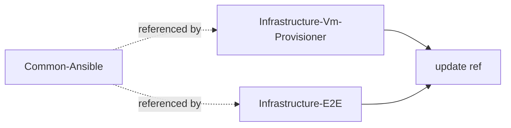

## Section 2 - Decouple the dispatch bridge

Make `ops/_run-playbook.sh` consumer-agnostic before any consumer code
moves out. See
[The bridge coupling to break](problem.md#the-bridge-coupling-to-break).

### Step 2.1 - Define the consumer contract

Specify how a wrapper declares its needs to the bridge: the inventory
vault to read, the extra vaults to read on top of it, plus any toggles
(host file server, token requirement). Encode as an explicit env contract
(`CA_INVENTORY_VAULT`, `CA_EXTRA_VAULTS`, `CA_NEEDS_HOST_FILE_SERVER`,
`CA_REQUIRES_TOKEN`). `CA_INVENTORY_VAULT` is required (the bridge always
needs an inventory and must name no vault itself); the rest default to
"none".

- **Reason:** A named contract is the seam that lets the substrate serve
  unknown future consumers without importing their identities - including
  the identity of whichever vault holds the fleet inventory.
- **Tests:** bats unit tests asserting the bridge parses each contract
  variable, applies the documented defaults when unset, rejects a missing
  required inventory vault, and errors on an inconsistent combination
  (token required but absent).
- **README:** None operator-facing yet - the contract parser is an
  internal bridge helper; its documentation lands with the
  bridge-contract rewrite in 2.2.

### Step 2.2 - Refactor the bridge to honor the contract

Replace the hardcoded `VmProvisioner` / `VmUsers` / `GitHubRunners` reads
and the `NEEDS_GITHUB_RUNNERS` / `GH_TOKEN` / `NEEDS_HOST_FILE_SERVER`
logic with the contract from 2.1. The bridge always reads one inventory
vault, but takes its name from `CA_INVENTORY_VAULT` rather than naming it;
extra vaults flow through as generic `--vault-config Name=path` pairs the
extra-vars composer dispatches by name.

Group the helpers that still know the fleet's shape under an
`ops/virtual-machines/` module: the inventory builder, the inventory
extra-vars fragment, the reachability probe, and the host file server
move there, and the Hyper-V/ICS/netsh-portproxy router resolution is
lifted out of `_run-playbook.sh` into a sourced `_resolve-router.sh` in
that module. The orchestrator sources the resolver instead of inlining
it, so it carries no topology knowledge itself.

- **Reason:** Removes the substrate's knowledge of any specific
  consumer's or provider's vault names - the dependency-inversion fix
  that earns the `Common-` prefix. Concentrating the remaining
  fleet-shape coupling (the `vm_provisioner_config` schema, the
  `<Name>Config-<suffix>` secret convention, the Hyper-V router
  topology) in `ops/virtual-machines/` makes it a visible, contained
  seam rather than scattering it through the otherwise generic bridge -
  the on-ramp for a later move to a fully fleet-agnostic substrate.
- **Tests:** bats over the bridge with simulated contracts; the existing
  create-users and register-runners flows still dispatch correctly via
  their updated wrappers (Step 2.3) under integration tests. The
  per-script bats (inventory, router reachability, staging, inventory
  extra-vars) and the host-file-server Pester suite stay green from
  their new `ops/virtual-machines/` location.
- **README:** Rewrite the "Bridge contract" section onto the `CA_*`
  contract and document the `ops/virtual-machines/` module grouping
  (inventory builder, router resolver, host file server). The
  operator-flow sections stay on the old wording until 2.3.

### Step 2.3 - Port the existing wrappers onto the contract

Update `create-users.sh` and `register-runners.sh` (and the remove/status
wrappers) to declare their needs via the contract
(`CA_INVENTORY_VAULT=VmProvisioner`, `CA_EXTRA_VAULTS`,
`CA_REQUIRES_TOKEN`, `CA_NEEDS_HOST_FILE_SERVER`) instead of the removed
bridge internals (`NEEDS_GITHUB_RUNNERS` / `NEEDS_HOST_FILE_SERVER`).
Step 2.2 left the bridge contract-driven, so until this step the wrappers
still export the dropped variables and the live flows do not dispatch -
this step closes that gap. Also rewrite the operator-flow README sections
(the create / register / deregister / status write-ups that still name
`NEEDS_GITHUB_RUNNERS` as "the bridge's vault-read gate") onto the `CA_*`
contract; 2.2 deliberately left them, since documenting the contract
before the wrappers used it would describe state that did not exist.

- **Reason:** Keeps both shipping flows working on the decoupled bridge,
  proving the contract before any code leaves the repo.
- **Tests:** Integration - create/remove users and register/deregister
  runners still run end to end (molecule + playbook tests unchanged).
- **README:** Rewrite the create / remove / register / deregister
  operator-flow sections and the setup-runners-secrets note onto the
  `CA_*` contract.

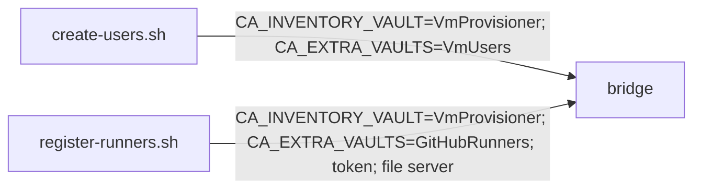

## Section 3 - Extract user provisioning to Infrastructure-Vm-Users

Move bucket B (see
[Common-Ansible partitioning](problem.md#common-ansible-partitioning)) to
its owner, consuming Common-Ansible for the substrate.

### Step 3.1 - Establish the Common-Ansible consumption mechanism

Wire how a consumer pulls Common-Ansible's reusable roles and ops: a
single **sibling checkout**. The roles are not standalone - they read the
dispatch bridge's extra-vars and inventory contract (`vm_users_config`,
`host_file_server_base_url`, the `vm_users_entry` fact, etc.) - so roles
and bridge are one substrate, consumed together from one resolved root
(resolver mirrors `ops/imports/_common-automation-root.sh`, overridable
via `COMMON_ANSIBLE_ROOT`). The consumer adds `<root>/roles` to
`ANSIBLE_ROLES_PATH` and references substrate roles by short name; the
controller venv and ops bridge are reused in place. This covers a
consumer's use of the *reusable substrate* roles. A consumer that owns
roles and a playbook of its own (Sections 3-4) additionally needs the
bridge to run *its* playbook with *its* roles and extra-vars fragment;
that consumer-root resolution is specified in
[Step 3.5](#step-35---resolve-a-consumers-own-playbook-roles-and-extra-vars-fragment-in-the-bridge).
A published Galaxy
collection was rejected because it could carry only the roles (the bridge
cannot ship in one - the controller bootstrap that builds the venv that
runs `ansible-galaxy` is itself part of the bridge), and roles have no
value without the bridge.

- **Reason:** Every consumer repo (Sections 3, 4, and the toolchain flow)
  needs one agreed reuse path; deciding it once here avoids per-repo
  drift. One mechanism for the indivisible roles-plus-bridge substrate
  beats splitting it across two transports.
- **Tests:** A clean controller bootstrap in Infrastructure-Vm-Users
  resolves the substrate sibling and reuses its controller; a smoke
  playbook that includes a substrate role by short name passes
  `ansible-playbook --syntax-check` with the sibling's `roles/` on
  `ANSIBLE_ROLES_PATH`.
- **README:** Document the sibling-checkout consumption path and bootstrap
  in Infrastructure-Vm-Users' README; describe the roles-plus-bridge
  "consume the substrate" model (and why not a Galaxy collection) in this
  repo's README.

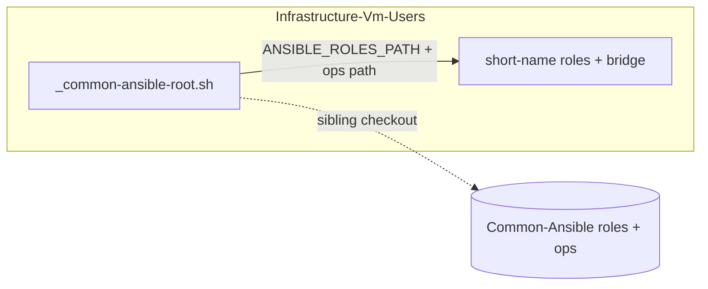

### Step 3.2 - Move the user roles, playbooks, and wrappers into Vm-Users

Relocate `vm_users_entry`, `groups`, `sudoers`, `users` (with molecule),
`create-users.yml`, `remove-users.yml`,
`playbooks/tasks/_ensure-acl-present.yml`, the user wrappers, and
`_build-extra-vars-users.sh`. They consume the substrate via 3.1. The
copies remain in Common-Ansible as a fork until Step 3.6.

- **Reason:** Puts the user domain with its owner while leaving
  Common-Ansible runnable, satisfying the keep-a-fork constraint.
- **Tests:** molecule per moved role in Vm-Users; create/remove-users
  integration against a disposable target.
- **README:** Infrastructure-Vm-Users' README gains the moved user
  roles/playbooks; this repo's README still documents the retained fork
  (removed in 3.6).

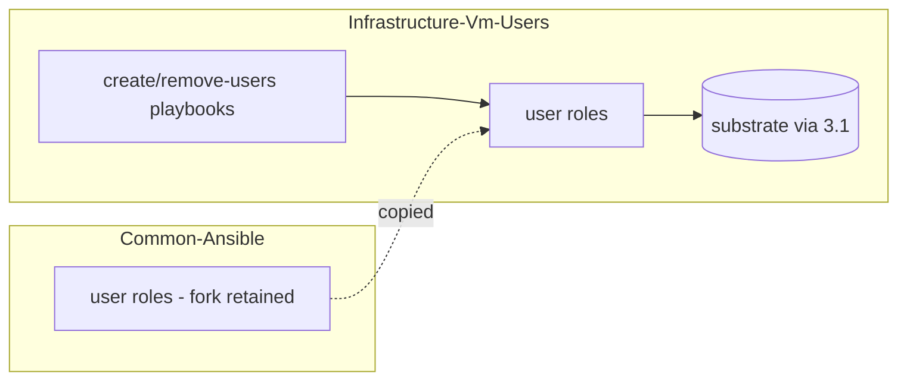

### Step 3.3 - Wire Vm-Users CI and README

Add the reusable lint/test CI to Vm-Users and document the create/remove
flows in its README index.

- **Reason:** The owner repo must enforce the same bar and carry its own
  operator docs.
- **Tests:** Vm-Users CI green (yamllint, shellcheck, molecule).
- **README:** Infrastructure-Vm-Users' README index documents the
  create/remove operator flows and the CI bar this step wires.

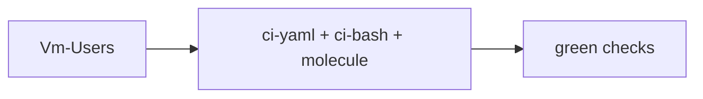

### Step 3.4 - Re-point the E2E users-ansible flow at Vm-Users

Update Infrastructure-E2E so the `ansible` users flow resolves
`create-users.sh` / `remove-users.sh` under `$UsersPath`
(Infrastructure-Vm-Users) instead of the shared `$AnsiblePath` ->
Common-Ansible. Split the "one checkout serves both domains" assumption:
the users-ansible flow now resolves within its owner repo, while the
runners-ansible flow keeps using the Common-Ansible checkout until
Section 4. Prove green before the fork is deleted in 3.6.

- **Reason:** Step 3.6 deletes Common-Ansible's user ops, so E2E must
  already dispatch to the owner repo or the ansible users flow breaks.
  Folding the path into `$UsersPath` also retires the "Ansible is a
  separate third repo" framing now that both user implementations live
  in Vm-Users.
- **Tests:** E2E users layer green on a disposable VM with
  `UsersFlow=ansible` resolving to Vm-Users ops; `custom-powershell`
  unchanged; the runners-ansible flow still resolves to Common-Ansible.
- **README:** Infrastructure-E2E's README/docs describe the
  users-ansible flow resolving under `$UsersPath`, retiring the
  "Ansible is a separate third repo" framing for the user domain.

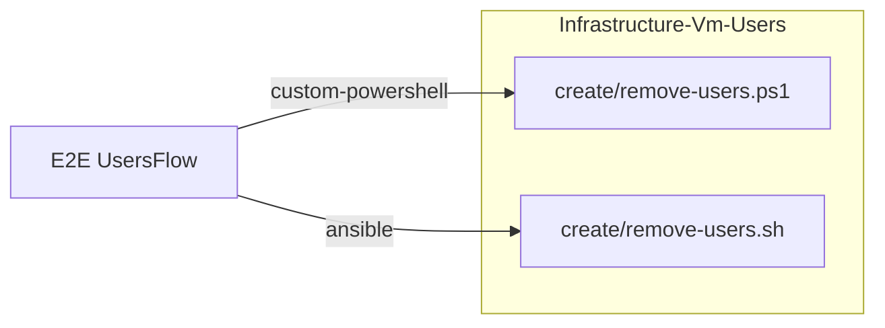

### Step 3.5 - Resolve a consumer's own playbook, roles, and extra-vars fragment in the bridge

Teach the bridge to run a *consumer's* playbook with the *consumer's*
roles and per-domain extra-vars fragment, not only its own. Add
`CA_CONSUMER_ROOT` to the consumer contract (Step 2.1): when set,
`_run-playbook.sh` resolves the playbook path relative to that root,
`_ansible-env.sh` prepends `<consumer-root>/roles` to
`ANSIBLE_ROLES_PATH` (the substrate `roles/` stays on the path so reusable
short-name roles still resolve), and `_build-extra-vars.sh` resolves the
declared vault's `_build-extra-vars-<domain>.sh` fragment from
`<consumer-root>/ops` rather than its own directory. Unset reproduces
today's substrate-root behaviour, so the retained runner fork keeps
dispatching unchanged. Under a Git Bash launch the root is a Windows path,
so it is translated to the `/mnt/...` form and added to `WSLENV` alongside
the other forwarded `CA_*` variables before the WSL re-exec.

Then switch the Vm-Users wrappers onto it: `create-users.sh` /
`remove-users.sh` export `CA_CONSUMER_ROOT` (the Vm-Users repo root) and
pass their own `playbooks/create-users.yml` / `remove-users.yml`, and the
bootstrap's roles-resolution note points at the Vm-Users `roles/`.
Vm-Users then runs its own copy with the substrate fork still present but
unused.

- **Reason:** Without this the bridge assumes every playbook, role, and
  fragment lives under its own root, so a consumer's moved copies are dead
  and the substrate fork is the live one. Resolving consumer-owned
  artifacts from a consumer root is the location half of consumer-
  agnosticism (the vault-name half is Steps 2.1-2.2) and the precondition
  that makes the Step 3.6 deletion safe instead of breaking the live flow.
- **Tests:** bats over the bridge - `CA_CONSUMER_ROOT` set resolves the
  playbook from the consumer root, orders the consumer `roles/` ahead of
  the substrate on `ANSIBLE_ROLES_PATH`, and dispatches the fragment from
  the consumer `ops/`; unset preserves substrate-root resolution (the
  runner fork still dispatches). Vm-Users integration - create/remove-users
  green resolving Vm-Users' own playbook and roles with the substrate fork
  still in place (assert the executed role/playbook path is under the
  Vm-Users root, e.g. via `ansible-playbook --list-tasks` / a `-vv` role
  path).
- **README:** Common-Ansible README "Bridge contract" / "Consume the
  substrate" documents `CA_CONSUMER_ROOT` (consumer-owned playbook, roles,
  and fragment resolution; default substrate-root behaviour). Vm-Users
  README "Consuming Common-Ansible" updates the roles-resolution
  description to the Vm-Users `roles/` directory.

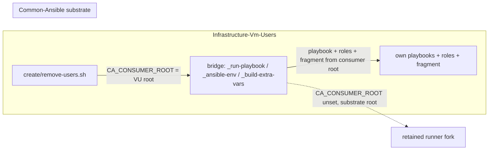

### Step 3.6 - Remove the user fork from Common-Ansible

With Vm-Users running its own copy (Step 3.5), delete the user
roles/playbooks/wrappers from Common-Ansible - the `groups`, `sudoers`,
`users`, `vm_users_entry` roles and their molecule scenarios, the
`create-users.yml` / `remove-users.yml` playbooks, the
`create-users.*` / `remove-users.*` wrappers, the substrate
`_build-extra-vars-users.sh` fragment and its `VmUsers` arm in
`_build-extra-vars.sh` - and drop the `VmUsers` references from its docs.
`playbooks/tasks/_ensure-acl-present.yml` stays: the retained runner
playbooks still include it, so it leaves with the runner fork in Step 4.4.

- **Reason:** A fork kept past proof becomes a second source of truth.
- **Tests:** Common-Ansible CI green with no user domain present (the
  retained runner fork still dispatches); grep confirms no
  `VmUsers`-specific code remains.
- **README:** Remove the create/remove-users operator-flow sections and
  every `VmUsers` reference from this repo's README and index.

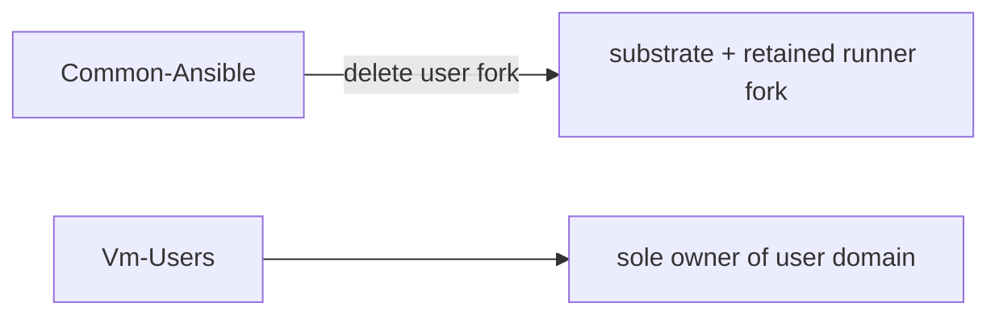

## Section 4 - Extract runner provisioning to Infrastructure-GitHubRunners

Mirror of Section 3 for bucket C.

### Step 4.1 - Move runner roles, playbooks, and wrappers into GitHubRunners

Relocate `runner_entry_resolve`, `runner_binary`, `runner_registration`,
`runner_service` (with molecule), the register/deregister/status
playbooks and their task includes, the runner wrappers,
`_require-gh-token.sh`, `_build-extra-vars-runners.sh`,
`_ensure-runner-tarball.ps1`, and `_resolve-runner-version.ps1`. They
consume the substrate (3.1) and declare `GitHubRunners` + token +
host-file-server via the contract (2.1). The runner wrappers also export
`CA_CONSUMER_ROOT` (the GitHubRunners repo root) and pass their own
playbooks, so the bridge runs the runner roles and the runner extra-vars
fragment from the GitHubRunners root via the mechanism added in Step 3.5 -
no new bridge work here, only the consumer-side adoption. Fork retained in
Common-Ansible until 4.4.

The runner config secret is **not** relocated as an Ansible wrapper. Both
the Ansible flow and GitHubRunners' existing PowerShell flow read the same
`GitHubRunnersConfig-<suffix>` secret from one local SecretStore vault,
written by the shared `hyper-v/ubuntu/shared/setup-secrets.ps1`. The
Common-Ansible fork's `setup-runners-secrets.*` only existed to reach that
writer across repos; co-located in GitHubRunners it would be a redundant
pass-through, so the Ansible flow points operators at the shared writer
directly and no Ansible secrets entry point is added.

Because both impls now coexist in GitHubRunners, the repo is organised into
self-contained per-impl slices under `hyper-v/ubuntu/`: `shared/` (the vault
setup both impls read), `PowerShell/` (the orchestrators), and `Ansible/`
(roles, playbooks, ops) - each carrying its own `Tests/`. Nesting the Ansible
slice keeps the substrate consumption working unchanged (the wrappers point
`CA_CONSUMER_ROOT` at the `Ansible/` slice, so the bridge stays agnostic), but
two seams need a shim: the `ops/imports/` sibling-resolvers walk three extra
levels, and a root `ansible.cfg` (`roles_path -> hyper-v/ubuntu/Ansible/roles`)
keeps the fleet ansible-lint gate - which only activates on root-level
`playbooks/`/`roles/`/`ansible.cfg` - linting the nested content. The shim is
lint-only; the runtime bridge uses the substrate's own `ansible.cfg`.
Infrastructure-Vm-Users is organised into the same self-contained slices
(`shared`/`PowerShell`/`Ansible`); its Infrastructure-E2E wiring is re-pointed
to the moved `PowerShell/` and `Ansible/ops/` flows accordingly.

Decouple the host file server from the runner-tarball resolvers as part
of this move. `ops/virtual-machines/_stage-host-fileserver.sh` stays
substrate but currently calls `../_resolve-runner-version.ps1` and
`../_ensure-runner-tarball.ps1` - the two `.ps1` relocating to
GitHubRunners above. Once they leave, those `../` references dangle, so
the staging helper must stop hardcoding runner-tarball resolution:
parameterize it so the consumer supplies the version and the staged
artifact (the file server itself serves any file; only the "which
runner tarball" knowledge is runner-domain). This coupling pre-dates the
`ops/virtual-machines/` grouping (2.2) - the grouping only made the seam
a concrete cross-`../` one - but it is resolved here, where the
resolvers actually move out.

- **Reason:** Runner domain to its owner; the host file server itself
  stays substrate and is reached through the contract - which requires
  severing its build-time dependency on the runner-tarball resolvers.
- **Tests:** molecule per moved role; register/deregister integration
  against a disposable runner target with a scoped token.
- **README:** Infrastructure-GitHubRunners' README gains the moved
  runner roles/playbooks and documents how the flow reaches the
  substrate host file server through the `CA_*` contract; this repo's
  README still documents the retained fork (removed in 4.4).

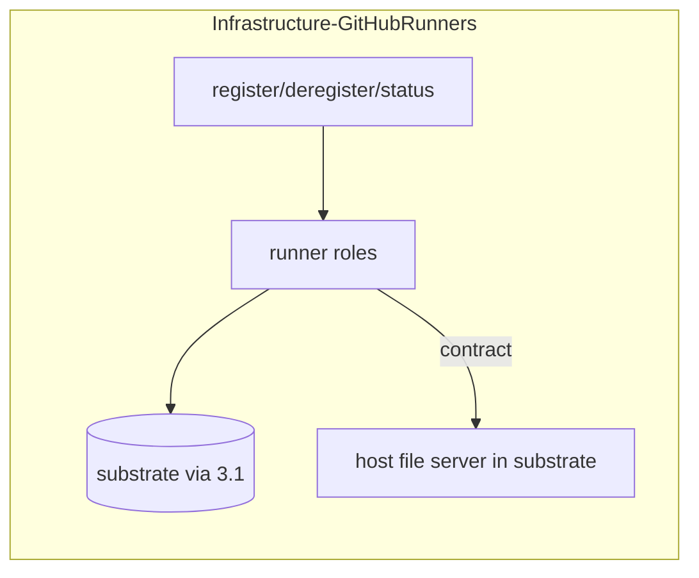

### Step 4.2 - Wire GitHubRunners CI and README

- **Reason:** Same bar and operator docs as the user owner.
- **Tests:** GitHubRunners CI green.
- **README:** Infrastructure-GitHubRunners' README index documents the
  register/deregister/status operator flows and the CI bar.

### Step 4.3 - Re-point the E2E runners-ansible flow at GitHubRunners

Update Infrastructure-E2E so the `ansible` runners flow resolves
`register-runners.sh` (and the status / deregister wrappers) under
`$RunnersPath` (Infrastructure-GitHubRunners) instead of `$AnsiblePath`
-> Common-Ansible. With Section 3 already off the shared path, this
removes the last E2E dependency on a Common-Ansible checkout, so
`$AnsiblePath` / `$WslDistro`-as-a-third-repo can be retired. Prove
green before the fork is deleted in 4.4.

- **Reason:** Step 4.4 deletes Common-Ansible's runner ops, so E2E must
  already dispatch to GitHubRunners or the ansible runners flow breaks.
  Completes the collapse of `$AnsiblePath` into the per-domain owner
  paths.
- **Tests:** E2E runner-lifecycle layer green on a disposable runner
  target with `RunnersFlow=ansible` resolving to GitHubRunners ops;
  `custom-powershell` unchanged; no E2E reference to Common-Ansible ops
  remains.
- **README:** Infrastructure-E2E's README/docs describe the
  runners-ansible flow resolving under `$RunnersPath` and the collapse
  of `$AnsiblePath` into the per-domain owner paths; no Common-Ansible
  reference remains.

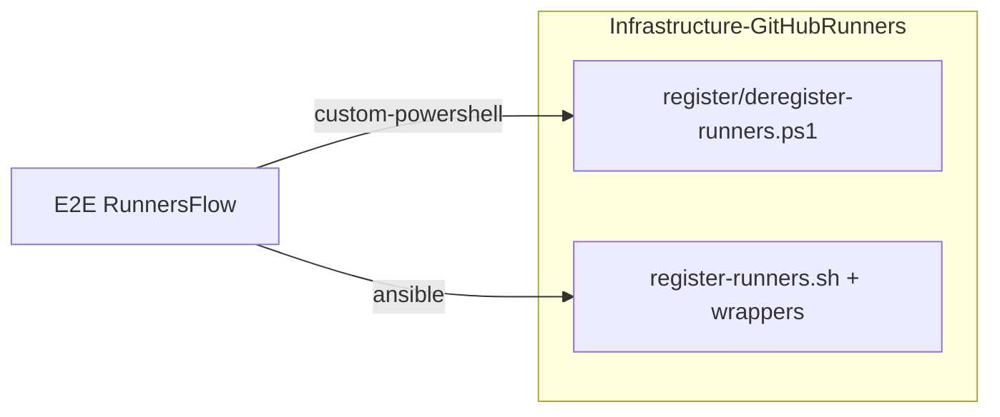

### Step 4.4.1 - Delete the runner fork from Common-Ansible

With GitHubRunners running its own copy (the Step 3.5 mechanism, adopted
in 4.1), delete every runner-specific artifact from Common-Ansible while
the composer's `GitHubRunners)` dispatch arm stays in place. The arm
resolves the owner's fragment from `CA_CONSUMER_ROOT`, so the GitHubRunners
owner keeps dispatching through it; only the substrate's own runner flows
(deleted here) ever used the local fragment. Dissolving that arm into a
generic rule is the separate Step 4.4.2, kept apart so the pure deletion
and the dispatch-contract change each get their own review.

Remove:

- the `runner_binary`, `runner_entry_resolve`, `runner_registration`,
  `runner_service` roles and their molecule scenarios;
- the `register-runners.yml` / `deregister-runners.yml` /
  `runner-status.yml` playbooks and their runner-only task includes
  (`_handle-unreachable-entry.yml`, `_runner-status-one.yml`), plus
  `playbooks/tasks/_ensure-acl-present.yml` (retained in Step 3.6 only
  because the runner playbooks still included it - it leaves with them);
- the runner wrappers (`register-runners` / `deregister-runners` /
  `runner-status` / `setup-runners-secrets`, `.sh` + `.bat`);
- the runner ops helpers `_build-extra-vars-runners.sh` (the local fork
  fragment), `_require-gh-token.sh`, `_resolve-runner-version.ps1`,
  `_ensure-runner-tarball.ps1`;
- the retained-fork path in
  `ops/virtual-machines/_stage-host-fileserver.sh` (resolve-runner-version
  + cache-the-tarball via the two `../` `.ps1`), making it serve-only -
  the consumer always supplies `--staging-dir` + `--runner-version`; the
  matching fork fallback and the `--github-token` forward to the staging
  helper drop from `ops/_run-playbook.sh`;
- the runner tests (`Tests/molecule/runner_*`, the runner bats
  `_build-extra-vars-runners` / `register-runners` / `deregister-runners`,
  `setup-runners-secrets.Tests.ps1`, and the runner-only `Tests/ansible/`
  deregister smoke playbook with its fixture inventory and the shared
  `Tests/mock-github-api.py`). Update the surviving substrate bats
  (`_run-playbook.bats`, `_stage-host-fileserver.bats`, the local-fragment
  cases in `_build-extra-vars.bats`) so they no longer exercise the deleted
  fork path; the `GitHubRunners)` arm itself stays covered via the
  consumer-root path until 4.4.2.

- **Reason:** A fork kept past proof becomes a second source of truth; the
  owner is proven (4.3), so the substrate's runner copy goes. Leaving the
  dispatch arm untouched isolates this pure deletion from the contract
  change in 4.4.2.
- **Tests:** Common-Ansible CI green with no runner roles / playbooks /
  wrappers present; the GitHubRunners consumer still dispatches through the
  retained `GitHubRunners)` arm (register/deregister run end to end); the
  serve-only `_stage-host-fileserver.bats` covers the consumer-staged path
  with the fork fallback gone.
- **README:** Remove the Vault setup / Register runners / Deregister
  runners / runner Roles sections from this repo's README and index. The
  Bridge contract and Consume-the-substrate sections stay (still naming
  `GitHubRunners` as the example consumer) for 4.4.2 to genericize.

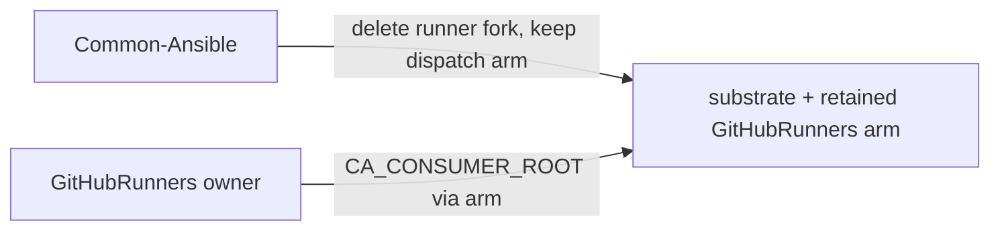

### Step 4.4.2 - Generalize the extra-vars dispatch and dissolve the GitHubRunners arm

The composer `ops/_build-extra-vars.sh` carries the substrate's last
hardcoded consumer identity: a `GitHubRunners)` arm that maps that vault
name to `_build-extra-vars-runners.sh` and routes the token / file-server
flags to it. The GitHubRunners owner kept only the fragment (4.1) and
dispatches *through* this arm, so it cannot simply be deleted - it is
dissolved into a generic rule, and the owner adopts the convention in
lockstep (one cross-repo step, per the [Conventions](#conventions)):

- substrate: each declared vault `<Name>` resolves
  `_build-extra-vars-<Name>.sh` under the fragment dir, receives its config
  through a generic flag, and is forwarded the optional
  `--github-token` / `--host-base-url` / `--runner-version` when the
  contract supplied them. The consistency checks stay but lose the
  `GitHubRunners` literal (a token, or a file-server pair, requires at least
  one declared extra vault). `ops/_run-playbook.sh` already forwards every
  declared vault generically, so its dispatch is unchanged;
- GitHubRunners owner: rename
  `hyper-v/ubuntu/Ansible/ops/_build-extra-vars-runners.sh` to
  `_build-extra-vars-GitHubRunners.sh` (matching the `<Name>` derivation)
  and consume the generic config flag; update its fragment bats.

- **Reason:** Dissolving the arm - not deleting it - removes the
  substrate's last consumer-specific identity while keeping the consumer
  that routes through it working. A future toolchain domain then plugs in
  as a peer `_build-extra-vars-<Name>.sh` with no substrate change.
- **Tests:** updated `_build-extra-vars.bats` / `_run-playbook.bats` assert
  the generic derivation and forwarding (and reject a declared vault whose
  fragment is absent); the GitHubRunners consumer dispatches via the renamed
  fragment (register/deregister run end to end); a repo-wide grep confirms
  no `GitHubRunners` reference remains in the substrate.
- **README:** Scrub `GitHubRunners` from the Bridge contract and
  Consume-the-substrate sections, genericizing the dispatch description and
  examples to the `_build-extra-vars-<Name>.sh` convention - leaving
  substrate + toolchains documented.

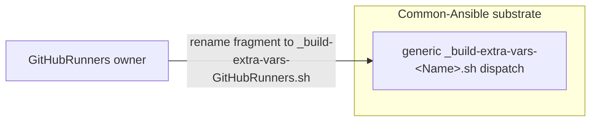

## Section 5 - Migrate existing toolchains to Ansible

Bucket D, section-1 tools. Port the PowerShell reconciler's JDK and .NET
behavior to reusable roles in Common-Ansible. The PowerShell reconciler is
kept as a fork in Infrastructure-Vm-Provisioner until the cutover
criterion in 5.6.

### Step 5.1 - Author the host-push toolchain role pattern

Build the shared mechanics one role models: pull a host-staged tarball
via the substrate file server, unarchive to a versioned install dir,
manage `/usr/local/bin` symlinks (either an explicit per-version list, or
`symlink_bin_dir` - a subdir whose files are all symlinked, enumerated at
install time, for a tool like the JDK whose launcher set is only known
post-extraction; both record every link in the manifest so uninstall
stays glob-free) and `/etc/profile.d/<tool>.sh`, write any fixed config
files a tool needs *outside* its install dir (an optional per-version
`owned_files` list - e.g. .NET's `/etc/dotnet/install_location`; each is
recorded in the manifest and removed on uninstall, never its shared parent
dir, so removal stays glob-free too), record installed versions as a fact,
and remove versions no longer desired (the one capability Ansible does not
give for free, per [Solution approach](problem.md#solution-approach)).

- **Reason:** Establishes the section-1 pattern so JDK/.NET roles differ
  only in their resolve/version logic.
- **Tests:** molecule covering install, idempotent re-run, version swap
  (old symlinks/profile removed), and uninstall-removed-versions.
- **README:** Document the host-push toolchain role pattern in this
  repo's README (and/or a role README under `roles/`) so the JDK/.NET
  roles can reference it.

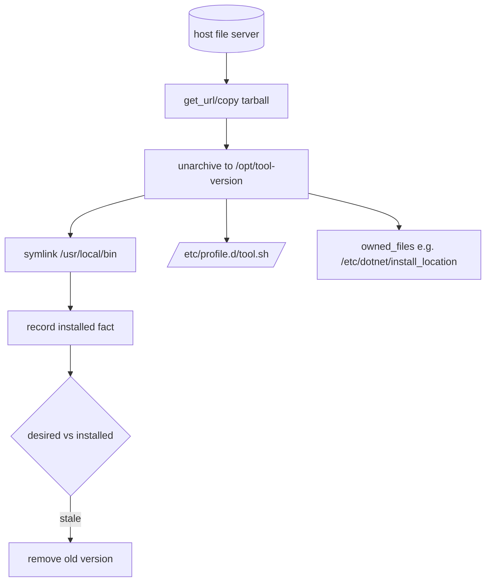

### Step 5.2 - jdk role

Port `JdkProvider` onto 5.1. The role adds only resolve/version logic: it
translates an operator pin (`21`, `21.0`, `21.0.5`, `21.0.5+11`) against
the Adoptium v3 GA API into a concrete `{version, archive}` (also
capturing the release checksum and download URL), then delegates install
/ swap / uninstall to the 5.1 pattern - `symlink_bin_dir: bin` to link
every JDK launcher, plus a `JAVA_HOME` + `PATH` profile. v1 installs one
JDK per host (a longer desired list is a hard error, mirroring
`Get-JdkDesiredVersions`). The Adoptium metadata query runs on the target
(only the large tarball uses the file-server NAT-bypass), so a fleet whose
targets cannot reach `api.adoptium.net` overrides the API base at a mirror.

The role does **not** verify the tarball checksum at install: it pulls
from the trusted substrate file server, and Adoptium byte-integrity is the
concern of the acquisition/staging step that fetches the tarball from
Adoptium and stages it on that file server ([Step 5.5-A](#step-55-a---toolchain-targeting-flow-in-a-consumer-repo)).
This is the same acquire/install split the PowerShell reconciler drew -
`Invoke-JdkAcquisition` verified the hash, `Install-JdkVersion` only
extracted. The resolver surfaces the checksum precisely so the staging
layer has it.

- **Reason:** First real consumer of the section-1 pattern; proves parity
  with the reconciler.
- **Tests:** molecule - install a pinned JDK, swap versions, uninstall,
  each driven by an in-container fixture serving both a canned Adoptium
  response and the fake tarballs (so resolve and install run end to end
  without the real API).
- **README:** `jdk` role README (purpose, variables, the resolution
  granularity table, and where checksum verification lives).


### Step 5.3 - dotnet_sdk role

- **Reason:** Second section-1 toolchain; parity with the SDK provider.
- **Tests:** molecule - install, version swap, uninstall.
- **README:** `dotnet_sdk` role README (resolve/install behaviour on the
  5.1 pattern).


### Step 5.4 - dotnet_tools role (nested under SDK)

Port the nested global-tools behavior; tools live under the SDK and are
torn down before the SDK on removal.

- **Reason:** Preserves the parent/child teardown ordering the reconciler
  guarantees.
- **Tests:** molecule - install a tool, remove the SDK, assert the tool is
  removed first.
- **README:** `dotnet_tools` role README, noting the parent/child
  teardown ordering (tools removed before the SDK).


### Step 5.5-A - Toolchain targeting flow in a consumer repo

Create the playbook + inventory wiring that targets production VMs with
the toolchain roles. This lives in a consumer (Infrastructure-Vm-Provisioner
or the runner owner), never in Common-Ansible, to keep the substrate
naming honest (see
[Why Common-, not Infrastructure-](problem.md#why-common--not-infrastructure)).

This step also owns **acquisition and staging**: fetching each resolved
toolchain tarball from upstream (Adoptium for the JDK), verifying the
release checksum the role surfaced, and staging it on the substrate host
file server under the resolved archive name the role pulls by. The roles
(5.1-5.4) deliberately do not re-verify at install (they pull from the
trusted file server) - staging is the integrity gate, the acquire/install
split the PowerShell reconciler drew. Staging must pin the resolution it
stages so the role's install-time resolve cannot pick a newer Adoptium
build than the one staged (the role re-resolves on the target); the
PowerShell reconciler pinned this via a per-cache lockfile, and the
consumer flow needs the equivalent pin here.

- **Reason:** Separates "reusable roles" (substrate) from "who gets what
  on which box" (a deploying consumer), and puts upstream fetch +
  integrity verification with the consumer that owns the estate's egress.
- **Tests:** Unit (in the consumer repo) - a tampered/mismatched checksum
  fails staging before anything reaches the VM, asserted against the
  acquire/verify/stage step with the resolvers and downloads stubbed. The
  live end-to-end assertion - the flow run against a disposable VM with the
  toolchain present and on PATH - runs through Infrastructure-E2E on PR, not
  as an in-repo suite (wired via the Step 5.5-B `ToolchainsFlow`
  selector), so live-Hyper-V coverage stays in the E2E repo.
- **README:** Document the toolchain targeting flow (playbook +
  inventory) and the acquire-verify-stage step in the consumer repo's
  README; this repo's README only references the reusable roles it
  consumes.

Target flow (this step):

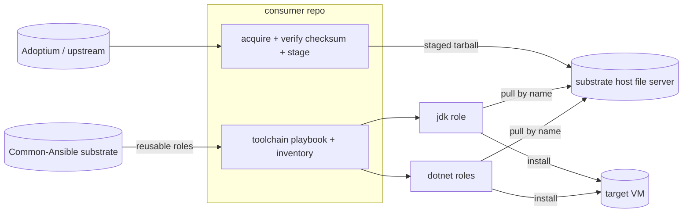

Prior flow (the PowerShell reconciler this replaces), shown for contrast -
one monolithic engine on the controller did resolve, acquire+verify, and
push-install per VM, with no substrate/consumer split:

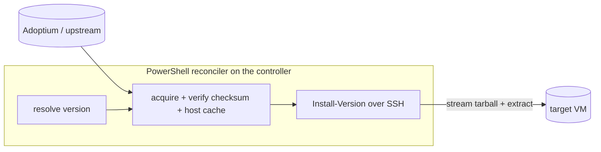

The split is the point of the contrast: the target flow moves upstream
fetch + integrity into a deploying consumer and the install mechanics into
reusable substrate roles, where the prior engine fused all three.

### Step 5.5-A.5 - Make the E2E toolchain assertions engine-agnostic

Prep for Step 5.5-B. The shared jdk / dotnet end-state assertions in
Infrastructure-E2E currently hard-code the PowerShell reconciler's
on-disk layout: the manifest store `/var/lib/infra-provisioner/manifests/`
(filenames `javaDevKit-*.json` / `dotnetSdk-*.json` / the tool manifest
shape) and the JDK install prefix `/opt/jdk-temurin-`. The Ansible
`toolchain_host_push` engine writes a different store -
`/var/lib/common-ansible/toolchains/manifests/` (`jdk-<v>.json`,
`dotnet-<v>.json`, `dotnettool-<id>-<v>.json`) - and installs the JDK
to `/opt/jdk-<v>` (no `temurin-` infix; the `.NET` SDK prefix `/opt/dotnet-`
already matches across both engines). It also uses a different manifest
*content* schema (a `version` / `symlinks` shape with no `children`
array). So the assertions cannot be reused verbatim across engines until
the engine-specific paths - and the reconciler-only content checks - are
lifted into parameters and a skip switch.

Parameterize each toolchain assertion helper - the jdk
install / uninstall / version-change / noop set, the dotnet_sdk
install / uninstall / version-change / noop set, and the dotnet_tools
install / uninstall / version-change set - with the values that
differ by engine: the manifest-store directory, the manifest filename
prefix, and the JDK install prefix. The filename prefix is the leading
segment of the manifest basename (`javaDevKit-` / `dotnetSdk-` /
`dotnetTools-` for the reconciler; `jdk-` / `dotnet-` /
`dotnettool-` for the Ansible engine): the jdk / dotnet_sdk helpers
derive their `<prefix>*.json` listing glob from it, while the
dotnet_tools helpers build the exact `<prefix><id>-<version>.json`
basename they probe. A prefix (not a full glob) is the seam because
the tool manifest name embeds the id and version, which a raw glob
string could not express. Every parameter defaults to the reconciler
value, so all existing `custom-powershell` call sites in the phase files
stay byte-for-byte identical and pass nothing new; Step 5.5-B's Ansible
caller passes the `common-ansible` values.

Path parameters make the jdk / dotnet_sdk assertions (which read only
manifest *presence*) fully engine-agnostic. The dotnet_tools install
helper additionally reads manifest *content* the Ansible engine does not
produce - its I4 field assertions (`rawVersion`, `ownedSymlinks`) and its
I5 parent-SDK `children` walker link are the reconciler's truth-source
schema - so that helper takes a `-SkipReconcilerManifestSchema` switch.
The Ansible caller sets it to run only the engine-agnostic checks (store
dir, symlink, apphost launch, tool-manifest presence); the reconciler
default leaves the content + walker assertions in place. The observable
end-state checks each helper already makes (present, on PATH, correct
`-version`, install-dir swap on version-change, dir removed on uninstall)
are untouched - only the store path, prefixes, and the tools content
switch become inputs.

This lands in Infrastructure-E2E, alongside the assertions it edits, and
is cross-repo from this repo per the [Conventions](#conventions). It ships
no behaviour change on its own: it is the seam Step 5.5-B needs to drive
the same assertions through the Ansible engine.

- **Reason:** Step 5.5-B's whole premise - the same jdk / dotnet
  assertions stay green with `ToolchainsFlow` flipped to `ansible` - is
  unattainable while the assertions probe the reconciler's manifest store
  and JDK prefix by literal path. Lifting those into
  reconciler-defaulted parameters is the prerequisite that makes the
  reuse real, and isolating it here keeps the parity refactor reviewable
  apart from the selector wiring.
- **Tests:** Unit tests for the parameterized assertion helpers (they are
  already dot-source-and-mock unit-testable in isolation) exercising both
  paths: the reconciler defaults (no override -> the existing
  `/var/lib/infra-provisioner` + `/opt/jdk-temurin-` expectations) and the
  Ansible overrides (`/var/lib/common-ansible/toolchains/manifests/` +
  `/opt/jdk-` -> the assertion probes the common-ansible store and prefix),
  plus the dotnet_tools install helper's `-SkipReconcilerManifestSchema`
  path (asserts tool-manifest presence and issues no parent-SDK walker
  probe). The existing phase-driven `custom-powershell` E2E run is
  unchanged (defaults preserve every current call site).
- **README:** Infrastructure-E2E's docs note that the toolchain assertions
  are engine-parameterized (manifest store, filename prefix, JDK
  install prefix) with reconciler defaults; this repo's (Common-Ansible)
  README is unchanged.

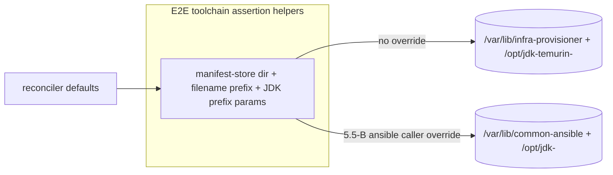

### Step 5.5-B - Select the toolchain flow in E2E (ToolchainsFlow)

Add a `ToolchainsFlow` selector to Infrastructure-E2E mirroring the
existing `UsersFlow` / `RunnersFlow` engine switches
(`agent/Invoke-E2EAgentLoop.ps1`): `custom-powershell` (default - the
retained PowerShell reconciler, today's behaviour) or `ansible` (the
Step 5.5-A flow), overridable from the menu payload alongside
`usersFlow` / `runnersFlow`. The default of `custom-powershell` leaves
every existing run unchanged. The selector gates only the install /
uninstall *driver* - which engine puts the toolchain on the VM - while
the existing jdk / dotnet end-state assertions (present, on PATH,
version-swap swaps install dirs, uninstall removes) are reused verbatim
across both engines. That reuse is what turns the Step 5.6 cutover into
a measured result: the same assertions must stay green with
`ToolchainsFlow` flipped to `ansible`.

This lands in Infrastructure-E2E, not the consumer repo - mirroring
Steps 3.4 / 4.3, which own the E2E re-point for the users and runners
domains. Step 5.5-A ships the flow in the consumer; this step wires
E2E to drive it. Cross-repo, per the [Conventions](#conventions).

- **Reason:** Without a selector, E2E only ever exercises the
  reconciler, so the Ansible flow's live-on-PR assertion (Step 5.5-A)
  and the Step 5.6 parity criterion have no harness to run through.
  Reusing the assertions across both engines is what makes "parity" a
  measurement, not a claim.
- **Tests:** E2E green on a disposable VM with `ToolchainsFlow=ansible`
  resolving the Step 5.5-A flow - the jdk / dotnet install, version
  swap, and uninstall assertions pass unchanged; `custom-powershell`
  (default) reproduces today's reconciler run byte-for-byte; the menu
  payload override selects the engine.
- **README:** Infrastructure-E2E's README/docs document the
  `ToolchainsFlow` selector and its menu-payload override alongside
  `UsersFlow` / `RunnersFlow`; this repo's (Common-Ansible) README is
  unchanged.

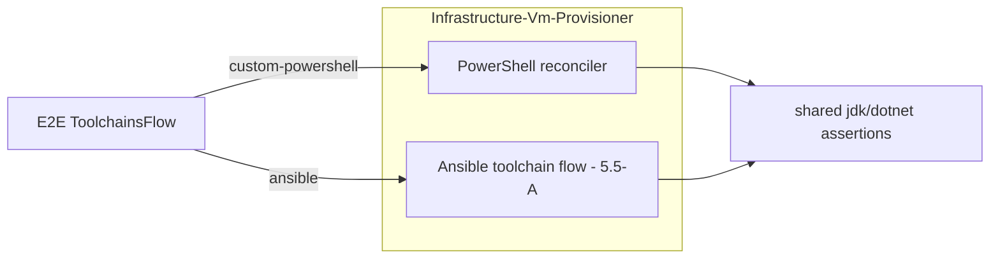

### Step 5.6 - Define the cutover criterion; keep the PS reconciler as a fork

Record the explicit condition under which the PowerShell reconciler is
retired (a later feature): the Ansible toolchain flow proven on a
production runner with parity on install/swap/uninstall. Parity is
measured by the Step 5.5-B `ToolchainsFlow=ansible` E2E run passing the
same install / swap / uninstall assertions the reconciler run passes.

- **Reason:** Two engines coexist transiently; the retirement trigger must
  be written, not implied.
- **Tests:** Documentation only; no code change. The reconciler stays
  active and tested in its repo.
- **README:** Record the cutover criterion in this feature's docs
  (problem.md/README); the reconciler's retirement is a later feature,
  so its repo README is unchanged here.

```mermaid
flowchart LR
  PS[PS reconciler - fork] -. retire when .-> CRIT[Ansible parity proven on prod]
  ANS[Ansible toolchain flow] --> CRIT
```

### Step 5.7 - Slice the Vm-Provisioner PowerShell reconciler into per-impl folders

Reorganize Infrastructure-Vm-Provisioner's flat `hyper-v/ubuntu/` tree into
the same self-contained per-impl slices the other consumers already carry
(Step 4.1): `shared/`, `PowerShell/`, `Ansible/`. The `Ansible/` slice
already exists (Step 5.5-A). Move the PowerShell reconciler - `common/`,
`up/`, `down/`, `provision.ps1`, `deprovision.ps1`, `ensure-vms-ready.ps1`,
`start-vms.ps1`, `Install-ModuleDependencies.ps1` - into `PowerShell/`, and
`setup-secrets.ps1` (the vault writer both impls read) into `shared/`.

The tree moves as a unit, so the reconciler's own `$PSScriptRoot`-relative
dot-sources survive untouched; the seams that break are the references from
outside the moved tree:

- the `.menu` files (`menus.psd1`, `cluster-order.psd1`,
  `manual-dependencies.psd1`, `Get-ScenarioMenus.ps1`) that resolve this
  repo's entry scripts by path;
- Infrastructure-E2E's resolution of `provision.ps1` / `deprovision.ps1`
  (and the `setup-secrets.ps1` writer); the E2E
  `ToolchainsFlow=custom-powershell` path (Step 5.5-B) reuses this same
  resolution, so it re-points with them - only reverification, not its
  own seam fix;
- every `Tests/` dot-source path - Tests mirrors production, so the Tests
  tree reorganizes in lockstep;
- Step 5.5-A's `Stage-ToolchainArtifacts.ps1`, whose reuse-reach into the
  reconciler resolvers (`..\..\up\jdk\Resolve-AdoptiumRelease.ps1`,
  `..\..\up\dotnet\Resolve-DotnetSdkRelease.ps1`) becomes
  `..\..\PowerShell\up\...`;
- the CI runner shims and README paths that name the moved scripts.

The `Ansible/ops/imports/` sibling-root resolvers are unaffected: they walk
six levels to the repo root and `Ansible/` stays at
`hyper-v/ubuntu/Ansible/`, so the Common-Ansible / Common-Automation sibling
resolution needs no change.

- **Reason:** One repo layout across the fleet - `shared` / `PowerShell` /
  `Ansible` means the same thing in every consumer - so the two toolchain
  impls (the PS reconciler and the Step 5.5 Ansible flow) are self-contained
  slices rather than a flat tree with an `Ansible/` subfolder bolted on.
  Recorded tension: the reconciler is slated for retirement at the 5.6
  cutover, so this is a deliberate symmetry choice that accepts churn on
  transitional code; kept a pure move (no behaviour change) to bound it.
- **Tests:** Pure relocation, no behaviour change - coverage must not
  regress. The existing Pester suite is green after its dot-source paths are
  repointed; provision / deprovision / ensure-vms-ready / start-vms still
  dispatch from `PowerShell/`; Step 5.5-A's toolchain Pester is green after its
  `..\..\PowerShell\up\...` update; the `.menu` loads and resolves the moved
  entry scripts; Infrastructure-E2E resolves the moved `provision.ps1` /
  `deprovision.ps1`.
- **README:** Update Infrastructure-Vm-Provisioner's README "Repo structure"
  and every script path it names to the sliced layout, and note the `shared`
  / `PowerShell` / `Ansible` slice convention it now shares with the other
  consumers; Infrastructure-E2E's docs that name the resolved paths update in
  lockstep. This repo's (Common-Ansible) README is unchanged.

```mermaid
flowchart LR
  subgraph before[flat]
    F1[common / up / down / reconciler *.ps1]
    F2[Ansible/ slice from 5.5]
  end
  subgraph after[sliced]
    S[shared/: setup-secrets.ps1]
    P[PowerShell/: common / up / down / reconciler *.ps1]
    A[Ansible/: toolchain flow]
  end
  F1 --> P
  F1 --> S
  F2 --> A
  P -. seams repointed .-> SEAMS[.menu / E2E / Tests / 5.5 dot-source]
```

## Section 6 - shellcheck role

Bucket D, section-2 (VM-downloaded).

### Step 6.1 - toolchain_apt role with a shellcheck-pinned use

Author a small section-2 role that installs a pinned apt (or `get_url`
static binary) package on the VM, and use it for shellcheck (apt
candidate `0.9.0-1` on the target's Ubuntu 24.04).

- **Reason:** Unblocks the original failure (`ci-bash` shellcheck step) in
  a durable, re-provision-safe way.
- **Tests:** molecule - shellcheck absent then present and on PATH;
  idempotent re-run.
- **README:** `toolchain_apt` role README (the section-2 pattern and the
  shellcheck-pinned use it ships with).

## Section 7 - bats role

### Step 7.1 - bats via the section-2 role

Install bats-core on the VM through the section-2 role (apt or upstream
tarball + install.sh).

- **Reason:** Makes the `ci-bash` test step self-sufficient on the runner
  rather than depending on the action's runtime install.
- **Tests:** molecule - bats absent then present and on PATH; a trivial
  `.bats` file runs.
- **README:** Document the bats install via the section-2 role (the
  `toolchain_apt` role README's use list, or a short note where the
  section-2 roles are described).

## Section 8 - docker role

Bucket D, section-3 (daemon).

### Step 8.1 - docker role: repo, engine, service, group

Install Docker from the official apt repo, enable the service, and add the
runner service user to the `docker` group.

- **Reason:** `ci-yaml` linters run in containers and `ci-dotnet`
  integration tests need a daemon; the group membership lets the runner
  user reach the socket without sudo.
- **Tests:** molecule - daemon reachable (`docker ps`), the target user is
  in the `docker` group, idempotent re-run. Note the docker-in-docker
  caveat for the molecule driver in the scenario.
- **README:** `docker` role README (repo/engine/service/group steps and
  the docker-in-docker molecule caveat).

```mermaid
flowchart TD
  REPO[official apt repo] --> ENG[docker engine]
  ENG --> SVC[enable+start service]
  SVC --> GRP[add runner user to docker group]
  GRP --> OK[docker ps as runner user]
```

## Section 9 - Config schema, wire the runner VM, verify green

### Step 9.1 - Add the three-section taxonomy to the VM config

Extend the per-VM config (the `VmProvisionerConfig-<suffix>` secret) with
a `toolchains` block carrying the three sections from
[the taxonomy](problem.md#the-three-section-tooling-taxonomy); the Ansible
extra-vars builder surfaces it to the toolchain roles, which validate
their own slice. Keep the config in the existing secret (one per-VM SSOT);
PS validation ignores the new block.

- **Reason:** Declarative desired-state for which tools land on which VM,
  read by the Ansible flow.
- **Tests:** Schema/validation unit tests for the new block; a malformed
  section fails with a clear message.
- **README:** Document the three-section `toolchains` config block (its
  shape and per-section validation) where the per-VM config schema is
  described.

```mermaid
classDiagram
  class VmConfig {
    +identity/network fields
    +toolchains.hostPushed[]
    +toolchains.vmDownloaded[]
    +toolchains.baseImage[]
  }
  VmConfig --> ExtraVars : built by bridge
  ExtraVars --> Roles : per-section dispatch
```

### Step 9.2 - Wire, declare, and prove sections 2 and 3 on the runner

Step 9.1 gave the taxonomy a validated shape but no consumer: the block rides
along in `vm_provisioner_config` and nothing installs from it. These three
sub-steps close that gap - wire the dispatch, declare the tools on the real
runner, and prove the end state on a VM - each reviewed and committed on its
own.

#### Step 9.2.A - Wire the consumer playbook to dispatch sections 2 and 3

The consumer playbook (`Infrastructure-Vm-Provisioner`
`hyper-v/ubuntu/Ansible/playbooks/provision-toolchains.yml`) composed only the
section-1 roles (jdk -> dotnet_sdk -> dotnet_tools). Extend it to select each
host's `toolchains` block off `vm_provisioner_config` (matching `vmName` to
`inventory_hostname`) and dispatch by section: `vmDownloaded` ->
`toolchain_apt_packages` (the role is always included, a no-op when empty), and
a `docker` entry in `baseImage` gates the `docker` role (a whole-daemon
install).

Docker group membership is deliberately NOT set here. This flow installs the
daemon but leaves `docker_group_members` empty, because the runner service user
(`runnerUsername`) is owned by the GitHubRunners config, not this provisioner
secret. GitHubRunners adds its runner user to the `docker` group in its own
flow (membership is additive), so the root-equivalent socket grant stays with
the repo that knows the user. This refines Section 8.1's "add runner user to
docker group": the role still can (via `docker_group_members`), but the grant
is a consumer concern placed in GitHubRunners, not in this provisioner flow.

- **Reason:** 9.1 validates the block but nothing installs from it; this is
  the missing per-host dispatch that turns a declared taxonomy into installed
  tools.
- **Tests:** `ansible-playbook --syntax-check` resolves all five roles via the
  sibling roles path; yamllint clean. The authoritative ansible-lint rule pass
  runs in `ci-ansible` (its composer stages the substrate roles onto
  `ANSIBLE_ROLES_PATH`). No molecule - the playbook is a thin composition and
  each role carries its own molecule scenario.
- **README:** Vm-Provisioner README - the toolchains-taxonomy-block section,
  the flow file-list, the config-schema table row, and the docker-group
  boundary.

```mermaid
flowchart LR
  CFG[vm_provisioner_config.toolchains] --> SEL[select by vmName]
  SEL -->|vmDownloaded| APT[toolchain_apt]
  SEL -->|baseImage: docker| DOCK[docker role]
```

#### Step 9.2.B - Declare shellcheck, bats, docker on ubuntu-02-ci and re-provision

Add the three tools to the `ubuntu-02-ci` definition in the
`VmProvisionerConfig-Production` secret (a `toolchains` block: `vmDownloaded`
shellcheck + bats, `baseImage` docker) and run the toolchain flow against it.

- **Reason:** Applies the work to the actual red runner.
- **Tests:** Post-run probe on the VM: shellcheck/bats present and on PATH at
  their pinned versions, the docker daemon installed and reachable
  (`sudo docker ps`). Runner-user socket access (the `docker` group membership
  `ci-yaml` / `ci-dotnet` need) is provisioned separately by GitHubRunners - a
  cross-repo prerequisite for 9.3, not this flow's output.
- **README:** Note the `ubuntu-02-ci` toolchain declaration in the consumer
  repo's README/config docs that own the production VM definitions.

```mermaid
flowchart LR
  SEC[(VmProvisionerConfig-Production)] -->|ubuntu-02-ci toolchains| FLOW[toolchain flow 5.5]
  FLOW --> VM[ubuntu-02-ci]
```

#### Step 9.2.C - E2E coverage for sections 2 and 3 (Infrastructure-E2E)

Prove the wired flow installs sections 2/3 on a real VM. The coverage lives in
Infrastructure-E2E (E2E is threaded through that repo + `menu.ps1`, not
embedded in the implementing repos) and runs under `ToolchainsFlow=ansible`
only - the PowerShell reconciler has no section-2/3 concept. Author a
`toolchains` block on the provisioning scenario's VM1 (shellcheck `0.9.0-1`,
bats `1.10.0-1`, docker); VM2 stays clean as the blast-radius witness proving
the per-host `selectattr` targeting does not leak the tools onto a VM that did
not declare them.

New per-assertion files mirror the jdk/dotnet pattern (one SSH-probing,
unit-tested file each): a `toolchain_apt` assertion (each pinned tool on the
non-login PATH, exact `dpkg-query` version, and executable - bats runs a
trivial `.bats`, `shellcheck --version` reports the pin), a `docker` assertion
(CLI present, `systemctl is-active docker`, `sudo docker ps` exit 0 - as root,
matching 9.2.A's boundary, NOT VM-admin group membership), and a "no
section-2/3 tools on VM2" witness. Install assertions run in Phase 1 (after the
jdk/dotnet assertions); Phase 2 re-runs the flow and re-asserts presence as the
idempotence proof. Lifecycle is install + idempotence only - the apt and docker
roles implement no removal, so there is no uninstall / version-change phase
(unlike jdk/dotnet). Docker on a real VM needs no docker-in-docker molecule
caveat.

- **Reason:** The section-2/3 path had role-level molecule coverage but was
  never exercised end-to-end on a VM (the existing E2E "toolchains" flow is
  section-1 only); this is 9.2's verification arm.
- **Tests:** The new assertion files plus their unit tests (mocking
  `Invoke-SshClientCommand`), mirroring
  `Tests/Invoke-JdkInstallAssertions.Tests.ps1`; the live run turns them green
  against a real VM.
- **README:** Infrastructure-E2E README - add the section-2/3 assertions to the
  provisioning scenario's coverage list.

```mermaid
flowchart LR
  V1[VM1: toolchains block] --> FLOW[ansible toolchain flow]
  FLOW --> A1[assert shellcheck/bats/docker present]
  V2[VM2: no toolchains] --> A2[assert absent - witness]
```

### Step 9.3 - Re-run the gates and confirm green

Re-trigger `ci-bash`, `ci-yaml`, and `ci-dotnet` on the SynergyOps.TaskManager
PR and confirm all pass on the self-hosted runner.

- **Reason:** Closes the loop on the originating failure.
- **Tests:** The three checks pass on the PR; record the run links in the
  feature README.
- **README:** Record the green `ci-bash` / `ci-yaml` / `ci-dotnet` run
  links in this feature's README, closing the loop on the originating
  failure.

```mermaid
flowchart LR
  VM[ubuntu-02-ci ready] --> CB[ci-bash green]
  VM --> CY[ci-yaml green]
  VM --> CD[ci-dotnet green]
```

## Section 10 - Decouple Common-Ansible from the provisioner

Severs the residual substrate -> Vm-Provisioner coupling described in
[problem.md](problem.md#the-residual-provisioner-coupling-severed-last): a
mismodeled menu edge, the implicit inventory shape, and the embedded estate
topology. Independent of Sections 5-9 (A and B could be pulled earlier);
grouped here as the substrate-cleanliness finish, before the merge. C-2
lands code in other repos, so it must precede Section 11.

### Step 10.1 - Decouple the substrate from the provisioner (A / B / C-1 / C-2)

Four committable substeps in increasing depth: drop the false edge, own the
inventory contract, introduce the transport hook, then relocate the Hyper-V
implementation behind it. Each is reviewed and committed on its own.

#### Step 10.1.A - Drop the mismodeled menu edge and re-settle the Level

Remove `'Common-Ansible' = @('Infrastructure-Vm-Provisioner')` from
`.menu/lib/Dependencies/manual-dependencies.psd1`. The substrate has no
code, build, or operational dependency on the provisioner repo: the
inventory vault name is consumer-declared (`CA_INVENTORY_VAULT`) and the
bats stub every vault read. The "provision first" ordering already lives on
the consumers (Vm-Users / GitHubRunners), which carry both edges. With the
false edge gone, raise Common-Ansible's `Level` in `.menu/menus.psd1` out of
the consumer tier into the shared-foundation tier (it no longer ranks below
Vm-Provisioner).

- **Reason:** A false edge mismodels the dependency gradient and pins the
  substrate below a repo it does not depend on.
- **Tests:** `menus.psd1` parses; `Get-ReposInGroup` ordering shows
  Common-Ansible in the foundation tier; the rebuilt dependency index no
  longer lists the edge. Menu metadata only - no repo code.
- **README:** None (workspace-orchestration metadata; no repo README).

```mermaid
flowchart LR
  subgraph before
    P1[Vm-Provisioner] -->|false edge| CA1[Common-Ansible]
  end
  subgraph after
    CA2[Common-Ansible: foundation tier]
    P2[Vm-Provisioner]
  end
```

#### Step 10.1.B - Make the inventory shape a substrate-owned contract

Document the fleet-inventory JSON shape - hosts with
`vmName`/`ipAddress`/`username`/`password`, plus the optional
`kind=="router"` row (`externalSwitchName`, optional static `ipAddress`) -
as Common-Ansible's *input contract*, in the repo README and a contract doc
under `docs/`. Add a `jq` shape-assertion in
`ops/virtual-machines/_build-inventory.sh` (and harden the existing
router-row field check in `_resolve-router.sh`) that fails loud, naming the
offending record and the missing field, when a provider payload omits a
required field - so a malformed inventory fails at the substrate boundary
with a clear message instead of deep inside ansible-playbook.

The `vm_provisioner_config` extra-vars key / `--provisioner-config` flag are
left as-is: renaming them to a neutral `fleet_inventory` is a contract change
touching every role and both consumers (and the version bump), out of scope
here and deferred.

- **Reason:** Turns an implicit, reverse-engineered shape into an explicit
  substrate-owned contract providers conform to - the inversion that removes
  the substrate -> provider arrow at the data layer.
- **Tests:** bats (`Tests/ops`) - `_build-inventory.sh` rejects a record
  missing `vmName` / `ipAddress` with a named error and accepts a valid
  fleet; the documented contract fields match the asserted set.
- **README:** Add an "Inventory contract" section to Common-Ansible's README
  defining the shape the substrate consumes.

```mermaid
flowchart LR
  PROV[Vm-Provisioner output] -->|conforms to| C[(inventory contract)]
  C -->|asserted by| BI[_build-inventory.sh]
```

#### Step 10.1.C-1 - Introduce the transport-resolution hook (substrate-only, no move)

Define an explicit hook: `CA_TRANSPORT_RESOLVER` names a script the bridge
sources to resolve the SSH transport for a NAT/router topology, exporting
`ROUTER_IP` / `ROUTER_SSH_HOST` / `ROUTER_USERNAME` / `SSHPASS` /
`ROUTER_PORT`, or doing nothing for a single-switch fleet. Unset selects a
built-in no-op default (CI, native Linux, direct-routing fleets). Route
`ops/_run-playbook.sh` through the hook instead of sourcing
`_resolve-router.sh` directly; `_resolve-router.sh` stays in the substrate
for now as the default provider the hook points at. No code moves and no
behaviour changes - this only inverts the dependency: the bridge depends on
the hook *contract*, not on the estate-specific resolver.

The seam is explicit (a consumer-supplied path), not sibling-discovery, on
purpose: an implicit seam that located the resolver in a Vm-Provisioner
checkout would make the substrate name that repo and re-introduce exactly
the edge 10.1.A removed.

- **Reason:** Establishes the interface so the Hyper-V implementation can
  leave in C-2 without the substrate ever naming a platform or a repo.
- **Tests:** bats (`Tests/ops`) - no-router-row fleets stay an unchanged
  no-op; with `CA_TRANSPORT_RESOLVER` set to a stub that exports `ROUTER_*`,
  `_build-inventory.sh` emits the ProxyCommand `ansible_ssh_common_args`
  aimed at the stub's `ROUTER_SSH_HOST`; an unset hook keeps the direct
  path. E2E runner-lifecycle stays green (the default still resolves
  Hyper-V).
- **README:** Document the `CA_TRANSPORT_RESOLVER` hook contract (exported
  vars, no-op default) in Common-Ansible's README.

```mermaid
flowchart LR
  RP[_run-playbook.sh] -->|sources| H{{CA_TRANSPORT_RESOLVER}}
  H -->|unset| NOOP[no-op default]
  H -->|set| RES[resolver provider]
  RES -.default still bundled.-> RR[_resolve-router.sh in substrate]
```

#### Step 10.1.C-2 - Relocate the Hyper-V implementation behind the hook

Pure move: lift `ops/virtual-machines/_resolve-router.sh` (and its sibling
`_assert-router-reachable.sh`) out of the substrate to the chosen estate
home, reusing the platform primitives that already live there -
`Get-VmKvpIpAddress` (`Infrastructure.HyperV`), netsh portproxy
(`Infrastructure-Network-Windows`), and the router-row semantics
(`Infrastructure-Vm-Provisioner`). The consumers (Vm-Users / GitHubRunners)
point `CA_TRANSPORT_RESOLVER` at the relocated resolver; the substrate drops
its bundled copy, keeping only the hook contract and the no-op default.
PowerShell helpers landing alongside Bash in the target repo is accepted.

> **Open decision (settle before this substep runs): the resolver's home.**
> Recommended single home is `Infrastructure-Vm-Provisioner` - it *creates*
> the netsh portproxy this resolver *discovers*, so create and discover are
> colocated, and the consumers already depend on it. A dedicated estate repo
> is the alternative if even a consumer -> Vm-Provisioner resolver edge is
> unwanted. Either way this does not re-couple the *substrate*: the hook is
> consumer-supplied (10.1.C-1), so the substrate still names no repo.

The host file server (`_stage-host-fileserver.sh` +
`_start`/`_stop-host-file-server.ps1`) is also Windows-specific but is a
separate, already-parameterized concern; relocating it behind the same
pattern is a future step, not part of 10.1.

- **Reason:** Removes the last estate-specific code from the substrate; the
  Hyper-V coupling becomes one provider behind the C-1 hook, so a
  non-Hyper-V consumer supplies its own resolver (or the no-op) without
  forking the substrate.
- **Tests:** The relocated resolver's bats move with it to its new repo and
  pass there; the substrate's bats cover only the hook + no-op (the
  estate-specific cases leave with the code); E2E runner-lifecycle is green
  with the consumers pointing `CA_TRANSPORT_RESOLVER` at the relocated
  resolver.
- **README:** The substrate README drops the resolver internals and points
  at the hook; the target repo's README documents the Hyper-V/ICS resolver
  it now owns.

```mermaid
flowchart LR
  subgraph SUB[Common-Ansible substrate]
    H{{CA_TRANSPORT_RESOLVER hook}}
    NOOP[no-op default]
  end
  subgraph EST[estate home - TBD]
    RES[_resolve-router.sh + _assert-router-reachable.sh]
    PRIM[Get-VmKvpIpAddress / netsh portproxy]
  end
  CONS[Vm-Users / GitHubRunners] -->|set CA_TRANSPORT_RESOLVER| H
  H --> RES
  RES --> PRIM
```

## Section 11 - Ordered cross-repo merge

The closing step. Up to here each repo's branch carries its own step
commits; this is where every repo's PR is finalized and merged in
dependency order. Scoped checkout consumes the substrate from a
Common-Ansible sibling on `master`, so there is no artifact to publish -
the ordering is what matters.

### Step 11.1 - Finalize and merge each repo PR in dependency order

Merge Common-Ansible first so the substrate (roles + bridge) is on
`master`, then the consumers - Infrastructure-Vm-Users,
Infrastructure-GitHubRunners, the toolchain consumer, and
Infrastructure-E2E - each of which resolves the substrate from a
Common-Ansible sibling checked out to `master`.

- **Reason:** Consumers consume Common-Ansible as a sibling checkout of
  `master` (no published artifact), so substrate changes must land on
  `master` before a consumer relies on them - otherwise a consumer's
  ansible-lint / flows cannot resolve the substrate roles and bridge.
  Ordered merge is the sequencing the cross-repo dependency forces.
- **Tests:** Each repo's CI is green post-merge; with Common-Ansible on
  `master`, every consumer's ci-yaml ansible-lint resolves the substrate
  roles from the sibling checkout (the consumer CI checks out
  Common-Ansible alongside and puts its `roles/` on `ANSIBLE_ROLES_PATH`,
  wired in each consumer's CI step).
- **README:** Record the final ordered-merge run links in this feature's
  README. There is no release/publish doc - scoped checkout has no
  published artifact.

```mermaid
flowchart LR
  CA[Common-Ansible PR] -->|merge to master| M[(substrate on master)]
  M --> VU[Vm-Users PR]
  M --> GR[GitHubRunners PR]
  VU --> CONS[toolchain + E2E PRs]
  GR --> CONS
```
