# Plan: ansible-lint CI in Common-Ansible

Implementation plan for the migration described in
[problem.md](./problem.md). Read that first - this file does not repeat
the rationale, the two locked decisions (controller venv; full
migration), or the survey.

## Index

- [Conventions and sequencing](#conventions-and-sequencing)
- [Cross-repo ordering (no coverage gap)](#cross-repo-ordering-no-coverage-gap)
- [Section 1 - Common-Ansible: stand up the venv ansible-lint gate](#section-1---common-ansible-stand-up-the-venv-ansible-lint-gate)
  - [Step 1.1 - Pin and hash-lock the lint toolchain](#step-11---pin-and-hash-lock-the-lint-toolchain)
  - [Step 1.2 - Bundled default config + venv helper + unit tests](#step-12---bundled-default-config--venv-helper--unit-tests)
  - [Step 1.3 - Composite action wrapping the helper](#step-13---composite-action-wrapping-the-helper)
  - [Step 1.4 - The `ci-ansible.yml` reusable workflow](#step-14---the-ci-ansibleyml-reusable-workflow)
  - [Step 1.5 - Local pre-push parity](#step-15---local-pre-push-parity)
  - [Step 1.6 - README for the gate](#step-16---readme-for-the-gate)
- [Section 2 - Consumers adopt `ci-ansible.yml`](#section-2---consumers-adopt-ci-ansibleyml)
  - [Step 2.1 - Infrastructure-Vm-Users](#step-21---infrastructure-vm-users)
  - [Step 2.2 - Infrastructure-GitHubRunners](#step-22---infrastructure-githubrunners)
- [Section 3 - Common-Automation: remove the old gate and plumbing](#section-3---common-automation-remove-the-old-gate-and-plumbing)
  - [Step 3.1 - Remove the ansible-lint step from `ci-yaml.yml`](#step-31---remove-the-ansible-lint-step-from-ci-yamlyml)
  - [Step 3.2 - Delete the composite action tree](#step-32---delete-the-composite-action-tree)
  - [Step 3.3 - Remove orphaned lib dependencies](#step-33---remove-orphaned-lib-dependencies)
  - [Step 3.4 - Drop ansible-lint from the local lint runner](#step-34---drop-ansible-lint-from-the-local-lint-runner)
  - [Step 3.5 - README and doc cleanup](#step-35---readme-and-doc-cleanup)
- [Section 4 - Verify and close](#section-4---verify-and-close)
  - [Step 4.1 - Cross-repo coverage verification](#step-41---cross-repo-coverage-verification)

## Conventions and sequencing

- Each step is the smallest committable act, states why it exists, names
  its tests, and carries a diagram of the components it touches.
- Master-only branches. Every step lands on `master` in its own repo
  before a later step in another repo depends on it.
- ASCII only; comments wrap at the repo's column conventions. README
  sections are earned per step (no trailing docs pass).
- "Green locally" for this repo means the relevant subset of
  `scripts/run-tests.sh` (bats via `run-bats-tests`, yamllint via
  `lint-yaml`, and - after Step 1.5 - ansible-lint via the new local
  step) plus `actionlint` / `action-validator` on any changed workflow.

## Cross-repo ordering (no coverage gap)

The only hard constraint the sequence must honour: no Ansible repo may
sit on `master` without an ansible-lint gate at any point. Common-
Automation's step is therefore the **last** thing removed, after every
consumer already gets the gate from Common-Ansible.

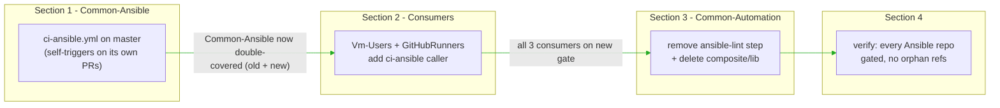

Coverage state after each section (X = ansible-lint runs against it):

| Repo | Start | After S1 | After S2 | After S3 |
| --- | --- | --- | --- | --- |
| Common-Ansible | ci-yaml | ci-yaml + ci-ansible | ci-yaml + ci-ansible | ci-ansible |
| Vm-Users | ci-yaml | ci-yaml | ci-yaml + ci-ansible | ci-ansible |
| GitHubRunners | ci-yaml | ci-yaml | ci-yaml + ci-ansible | ci-ansible |
| non-Ansible repos | ci-yaml (skips) | (skips) | (skips) | no step |

No cell is ever empty for an Ansible repo - the transition is always
additive-then-subtractive.

## Section 1 - Common-Ansible: stand up the venv ansible-lint gate

### Step 1.1 - Pin and hash-lock the lint toolchain

**Why.** The venv decision moves the version pin from Common-Automation's
`versions.env` into Common-Ansible, and the
[hermeticity constraint](./problem.md#the-hermeticity-trade-off-and-how-it-is-closed)
requires the full dependency closure be hash-locked, not just a top-level
`==` pin. This step is the reproducibility foundation every later CI/local
run installs from.

**What.**

- Introduce a compiled, hashed requirement set for the controller venv:
  a human-edited `requirements.in` (sources: `ansible-core`,
  `ansible-lint`) compiled with `pip-compile --generate-hashes` into the
  existing `requirements.txt` (now the fully-pinned, `--hash`-annotated
  lockfile). Keep the current explanatory header.
- Teach the venv bootstrap to enforce the lock: change
  [`ops/_bootstrap-controller-wsl.sh`](../../../../ops/_bootstrap-controller-wsl.sh)
  line ~134 to `pip install --require-hashes -r requirements.txt`, so a
  drifted or unhashed line fails loudly rather than floating.
- **Resolve the ansible-lint / ansible-core compatibility** (a real
  decision, not a mechanical pin): the current CI value is
  `ansible-lint==26.4.0`, but the venv pins `ansible-core==2.18.1`, and
  recent ansible-lint majors raise their `ansible-core` floor. During
  execution, `pip-compile` will surface the constraint; the **default
  resolution is to keep `ansible-core==2.18.1` unchanged and pin the
  newest ansible-lint line that resolves against it** (do not bump
  ansible-core - that would perturb the collections and the molecule/
  target toolchain, which is out of scope per problem.md). If no
  reasonably-recent ansible-lint line supports 2.18.1, stop and raise the
  ansible-core bump as a separate decision rather than making it silently.

**Tests.**

- Bootstrap the venv from a clean `.venv`; assert
  `pip install --require-hashes -r requirements.txt` succeeds (proves the
  closure is fully hashed and self-consistent).
- Assert `.venv/bin/ansible-lint --version` prints the pinned version and
  `.venv/bin/ansible --version` still prints `2.18.1` (proves co-install).
- Extend the existing bootstrap bats coverage (if the pinned-versions
  summary is asserted there) to include the ansible-lint line.

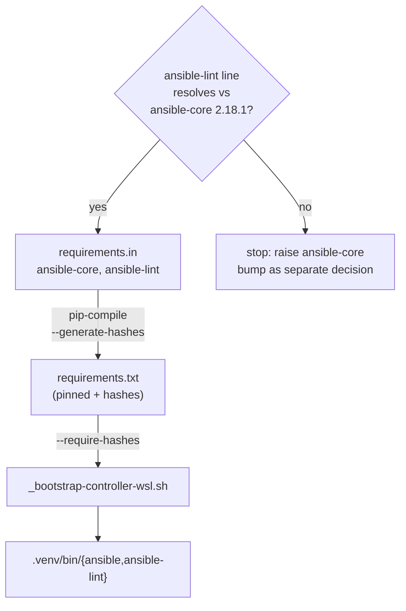

### Step 1.2 - Bundled default config + venv helper + unit tests

**Why.** The auto-skip and consumer-config-vs-bundled-`production`
resolution are behaviour that must survive the move; only the invocation
underneath changes from `docker run` to a direct `ansible-lint` call. A
single helper keeps CI and local identical (the SSOT the old composite
had).

**What.**

- Add the bundled default config
  `.github/actions/ansible-lint/ansible-lint.config.yml` - the strict
  `production` profile. Port it from Common-Automation but correct the
  staging-dir note: the `exclude_paths` keep `.github/` (covered by
  actionlint / action-validator) and replace the `.common-automation/`
  entry with `.common-ansible/` (the sibling-checkout dir this workflow
  introduces in Step 1.4).
- Add the venv helper `.github/actions/ansible-lint/ansible-lint.sh`:
  - Auto-skip: no `ansible.cfg` / `playbooks/` / `roles/` at the target
    root -> `::notice::` + exit 0.
  - Consumer-config resolution: a repo-root `.ansible-lint[.yml|.yaml]`
    wins; else pass `-c <bundled config>`.
  - Invoke `ansible-lint --project-dir <target> [--force-color]
    [-c <config>]` from PATH (venv activated by the caller). No docker, no
    `retry.sh`, no version getter, no `--user`/mount plumbing.
- No dependency on `.github/lib` (Common-Ansible has none) - the helper is
  self-contained plus the adjacent config.

**Tests.** Port the docker-free bats cases and add a venv guard mirroring
the old `require_docker`:

- `auto-skips when no Ansible content exists` (no venv needed).
- `auto-skips when only unrelated YAML is present`.
- `exits 0 on a minimal valid playbook` - `require_ansible_lint` skip when
  `.venv/bin/ansible-lint` is absent.
- `exits non-zero on a playbook with a known violation`.
- `honours a consumer-supplied .ansible-lint config` (profile `min`).
- The three docker-build **retry** cases are **not ported** - the retried
  artifact (image build) no longer exists (recorded as a deliberate
  coverage reduction in the [test note](#step-16---readme-for-the-gate)).

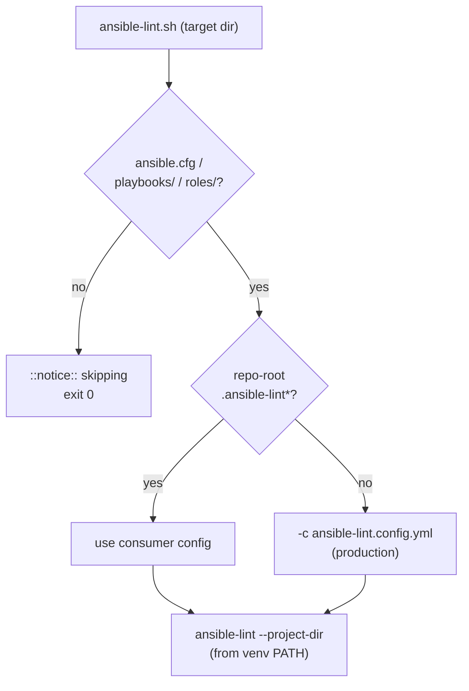

### Step 1.3 - Composite action wrapping the helper

**Why.** Mirror the established composite pattern (every other lint gate
is a `uses:`-able composite) so the workflow's self/consumer branching in
Step 1.4 is uniform, and so the helper stays the single invocation both CI
and local share.

**What.**

- Add `.github/actions/ansible-lint/action.yml` - a `composite` that runs
  `ansible-lint.sh` from `${{ github.action_path }}`, expecting the venv
  already on PATH (the workflow puts it there in Step 1.4). Description
  states it lints the caller repo and auto-skips on no Ansible content;
  no `${{ }}` in the `description` field (composite manifests evaluate it
  at load time).

**Tests.** `action-validator` on the new `action.yml`; the helper's own
behaviour is already covered by Step 1.2's bats.

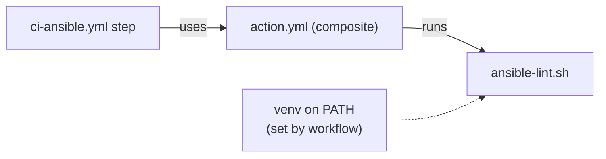

### Step 1.4 - The `ci-ansible.yml` reusable workflow

**Why.** The Ansible-domain workflow this whole feature exists to create.
It also establishes the **shared sibling-checkout + `ANSIBLE_ROLES_PATH`
wiring** that [feature 21](../21-molecule-ci-in-common-ansible/problem.md)
reuses for molecule - so this step owns that wiring, not feature 21.

**What.** Add `.github/workflows/ci-ansible.yml`, modelled on Common-
Automation's `ci-yaml.yml` (same runner-selection precedence: `runner`
input -> `CI_ANSIBLE_RUNNER` caller variable -> `ubuntu-latest`; same
`pull_request` + `workflow_dispatch` + `workflow_call` triggers so it
self-triggers on its own PRs and is callable by consumers). One `ansible`
job:

1. Check out the caller repo.
2. **Stage the Common-Ansible sibling** into `.common-ansible/` via a
   conditional sparse checkout (`ref: master`, paths: `.github/actions`,
   `requirements.txt`, `requirements.yml`, `ansible.cfg`, `roles`) - only
   when `github.repository != Klark-Morrigan/Common-Ansible`. This gives a
   consumer the pinned toolchain, the bundled config, and the substrate
   `roles/` for short-name resolution. (Self runs use its own workspace.)
3. `actions/setup-python` pinned to the interpreter minor (3.12) - the
   [hermeticity](./problem.md#the-hermeticity-trade-off-and-how-it-is-closed)
   interpreter pin.
4. `pip install --require-hashes -r <self-or-sibling>/requirements.txt`,
   then put the resulting `bin/` on `$GITHUB_PATH`.
5. `ansible-galaxy collection install -r <...>/requirements.yml` (parity
   with local; needed by feature 21's molecule that reuses this wiring).
6. Export `ANSIBLE_ROLES_PATH` as `<caller>/roles:.common-ansible/roles`
   (consumer) or `<self>/roles` (self), the same short-name resolution
   `ops/_ansible-env.sh` encodes.
7. Run the ansible-lint composite - self branch `./.github/actions/ansible-lint`,
   consumer branch `./.common-ansible/.github/actions/ansible-lint` - each
   `if:`-guarded on `github.repository`, matching `ci-yaml.yml`'s
   local-`./`-refs rationale (eager registry resolution vs step-time
   local resolution).

**Tests.** `actionlint` + `action-validator` on the new workflow; then a
live PR against Common-Ansible exercises the **self** branch end-to-end
(the roles in this repo lint clean under `production`, or the failures are
triaged per the `lint-ansible` skill's noqa guidance). The consumer branch
is exercised in Section 2.

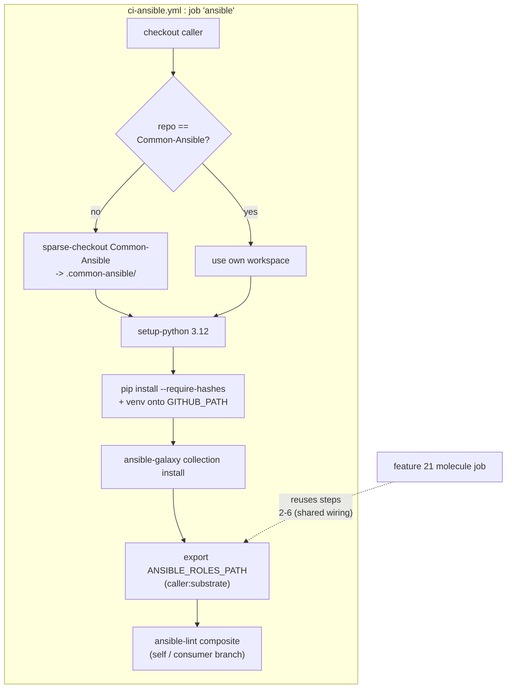

### Step 1.5 - Local pre-push parity

**Why.** Common-Ansible's local lint (`scripts/run-lint-yaml-and-bash.sh`)
delegates to Common-Automation's `_run-lint-yaml-and-bash.sh`, which
Section 3 strips of its ansible-lint step. Without a replacement, this
repo's own pre-push run would stop linting its roles. Item 5 of
[problem.md](./problem.md#what-is-changing) requires a venv-based local
step matching the `lint-ansible` skill.

**What.**

- Add `scripts/run-lint-ansible.sh`: activate `.venv` and run the Step 1.2
  helper against the repo root (auto-skips cleanly if the venv or Ansible
  content is absent). This is the local twin of the composite - same
  helper, same config resolution.
- Wire it into `scripts/run-lint-yaml-and-bash.sh` so a full local lint
  run still covers ansible-lint after the delegated Common-Automation half
  drops it. Order it after the delegated call; track its failure in the
  same summary style.

**Tests.** Run `scripts/run-lint-yaml-and-bash.sh` locally; assert the
ansible-lint step runs against this repo's `roles/` and the overall run is
green (or surfaces only pre-existing, triaged findings).

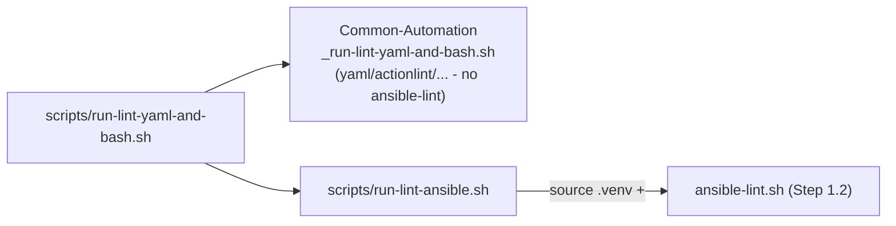

### Step 1.6 - README for the gate

**Why.** Document the new gate where it now lives, per the earned-section
rule.

**What.** Add a README section to Common-Ansible covering: the
`ci-ansible.yml` reusable workflow and how a consumer wires it; the venv
execution model and the hash-locked requirement set (link
problem.md's hermeticity subsection); the bundled `production` default and
consumer-config override; and a short note that the docker-build **retry**
tests were dropped with the docker path (the deliberate coverage
reduction). Keep the repo README's structured index in sync.

**Tests.** `lint-yaml` / markdown-lint parity as the repo already applies;
link-check the new anchors.

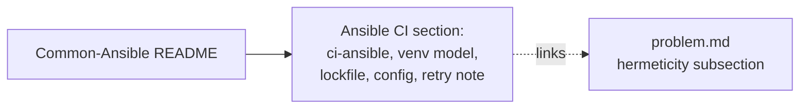

## Section 2 - Consumers adopt `ci-ansible.yml`

Prerequisite: Section 1 merged to Common-Ansible `master` (the reusable
workflow and composite must be resolvable at `@master`).

### Step 2.1 - Infrastructure-Vm-Users

**Why.** Move this consumer onto the new gate while `ci-yaml.yml` still
runs (double coverage - zero-gap per the
[ordering table](#cross-repo-ordering-no-coverage-gap)).

**What.**

- Add `.github/workflows/ci-ansible.yml` - a thin caller:
  `uses: Klark-Morrigan/Common-Ansible/.github/workflows/ci-ansible.yml@master`,
  `name: Common-Ansible`, `on: [pull_request, workflow_dispatch]`.
- Update the existing `ci-yaml.yml` header comment: it currently claims
  four parallel lint jobs including ansible-lint; correct it to the three
  cross-cutting linters and note the Ansible gate now comes from
  Common-Ansible's `ci-ansible.yml`.

**Tests.** `actionlint` / `action-validator` on the new workflow; a PR run
confirms the `ansible` job runs green against this repo's Ansible content
via the consumer (sibling-checkout) branch established in Step 1.4.

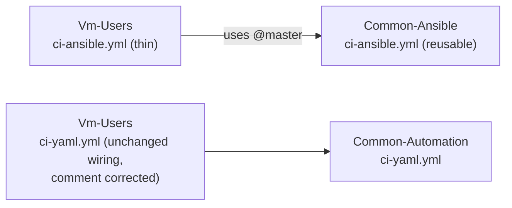

### Step 2.2 - Infrastructure-GitHubRunners

**Why / What / Tests.** Identical to Step 2.1 for the
Infrastructure-GitHubRunners repo (same thin caller, same header-comment
correction, same PR verification). Kept a separate step so each consumer
lands and is verified independently.

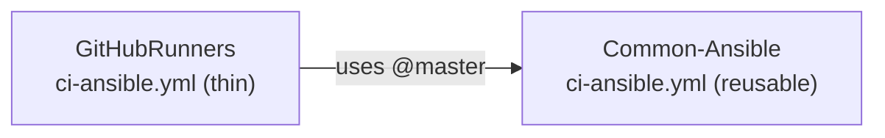

## Section 3 - Common-Automation: remove the old gate and plumbing

Prerequisite: Section 2 merged - all three Ansible repos (Common-Ansible
via self-trigger, Vm-Users, GitHubRunners) now get ansible-lint from
Common-Ansible on `master`. Only now is it safe to remove the old gate.

### Step 3.1 - Remove the ansible-lint step from `ci-yaml.yml`

**Why.** The gate is re-homed and every consumer already has it; the step
in the universal workflow is now the domain leak problem.md set out to
remove. No repo loses coverage (ordering table, "After S3" column).

**What.** In Common-Automation `.github/workflows/ci-yaml.yml` delete both
`ansible-lint (self)` and `ansible-lint (consumer)` steps and their
trailing comment block; update the workflow's top-of-file description
(currently "four complementary surfaces") to the three that remain.

**Tests.** `actionlint` / `action-validator`; a PR run confirms the
`yaml` job passes with three linters and no ansible-lint step.

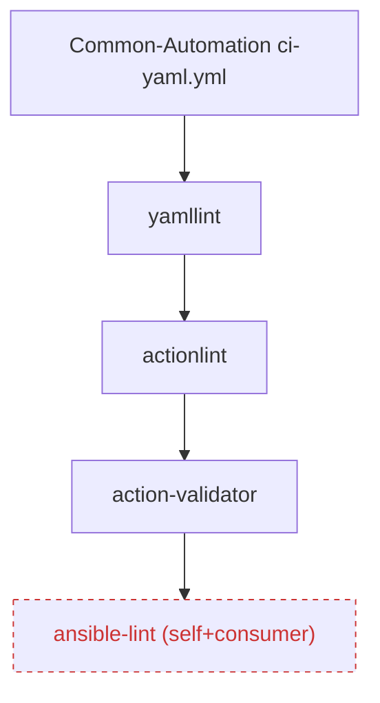

### Step 3.2 - Delete the composite action tree

**Why.** Dead once Step 3.1 stops referencing it; leaving it invites a
second source of truth to drift from Common-Ansible's copy.

**What.** Delete `.github/actions/ansible-lint/` in Common-Automation
(`action.yml`, `ansible-lint.sh`, `Dockerfile`, `ansible-lint.config.yml`,
`README.md`, `ansible-lint.bats`).

**Tests.** Repo bats suite green; `grep -r ansible-lint .github` returns
nothing outside historical docs; `action-validator` still green (one fewer
action).

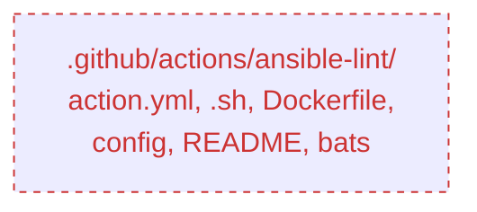

### Step 3.3 - Remove orphaned lib dependencies

**Why.** `get-ansible-lint-version.sh` and the `versions.env`
`ANSIBLE_LINT_VERSION` entry existed **only** for the composite (verified:
their sole non-doc consumers were the deleted composite/Dockerfile).
`retry.sh` is **kept** - it has many live consumers (actionlint,
action-validator, yamllint, changelog).

**What.**

- Delete `.github/lib/get-ansible-lint-version.sh` and
  `get-ansible-lint-version.bats`.
- Remove `ANSIBLE_LINT_VERSION` (and its yamllint cross-check comment)
  from `.github/lib/versions.env`.
- Update Common-Automation `README.md` where it references the ansible-
  lint version getter / composite.
- Leave `retry.sh`, its classifiers, and strategies untouched.

**Tests.** `grep -r "ANSIBLE_LINT_VERSION\|get-ansible-lint-version"`
returns nothing outside `.git` / `graphify-out` / historical docs; the
remaining `get-*-version` bats suites pass; the retry bats suite passes.

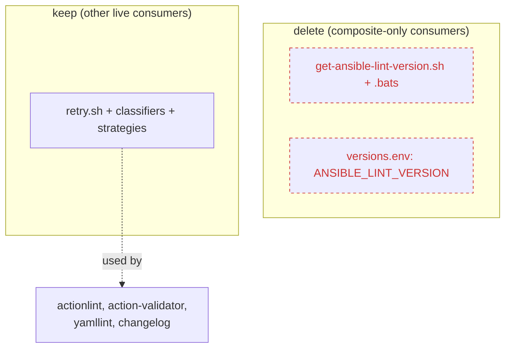

### Step 3.4 - Drop ansible-lint from the local lint runner

**Why.** `_run-lint-yaml-and-bash.sh` calls the deleted helper; leaving
`run_ansible_lint` would break every local lint run in Common-Automation
and every repo that delegates to it (including Common-Ansible, which now
runs its own via Step 1.5).

**What.** In `scripts/_run-lint-yaml-and-bash.sh` remove the
`run_ansible_lint` function, its `if ! run_ansible_lint` call site, and
its failure-tracking entry; update the file header's linter list.

**Tests.** Run `scripts/_run-lint-yaml-and-bash.sh` against Common-
Automation itself (no Ansible content) and confirm it no longer references
ansible-lint and stays green; confirm a delegating repo's
`run-lint-yaml-and-bash.sh` still runs.

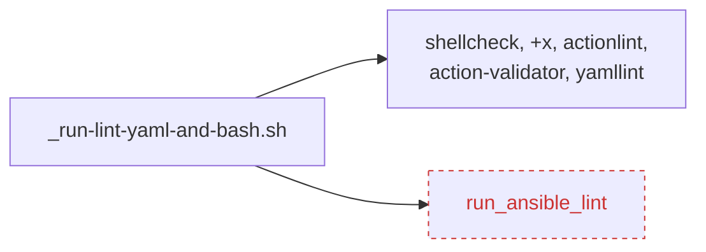

### Step 3.5 - README and doc cleanup

**Why.** Keep Common-Automation's docs truthful: it is now strictly the
cross-cutting linters, and its charter statement is vindicated rather than
contradicted.

**What.** In Common-Automation `README.md` (and any composite index),
remove ansible-lint from the actions list / the ci-yaml linter
enumeration, and add a one-line pointer that Ansible linting now lives in
Common-Ansible's `ci-ansible.yml`. Keep the structured index in sync.

**Tests.** `lint-yaml` / markdown parity; link-check.

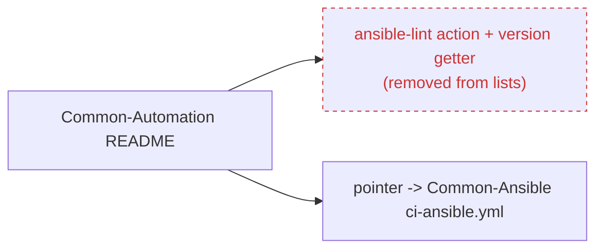

## Section 4 - Verify and close

### Step 4.1 - Cross-repo coverage verification

**Why.** The migration's success criterion is behavioural, not textual:
every Ansible repo is still gated, no non-Ansible repo carries a dead
step, and nothing references the deleted plumbing. This step proves it
before the feature is called done.

**What.**

- Confirm on `master` for each of Common-Ansible, Vm-Users,
  GitHubRunners that a PR triggers the `ci-ansible / ansible` check and it
  runs (not skips) against real Ansible content.
- Confirm Infrastructure-Vm-Provisioner (no root Ansible content) simply
  no longer carries the ansible-lint step and its `ci-yaml` still passes.
- Confirm no repo references `Common-Automation/.github/actions/ansible-lint`
  or `ANSIBLE_LINT_VERSION` any longer.
- Finalize the feature README index entry and mark the checklist in this
  plan complete.

**Tests.** The three consumer PR runs above are the test; plus a
cross-repo `grep` sweep for the removed identifiers returning empty.

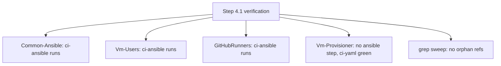
