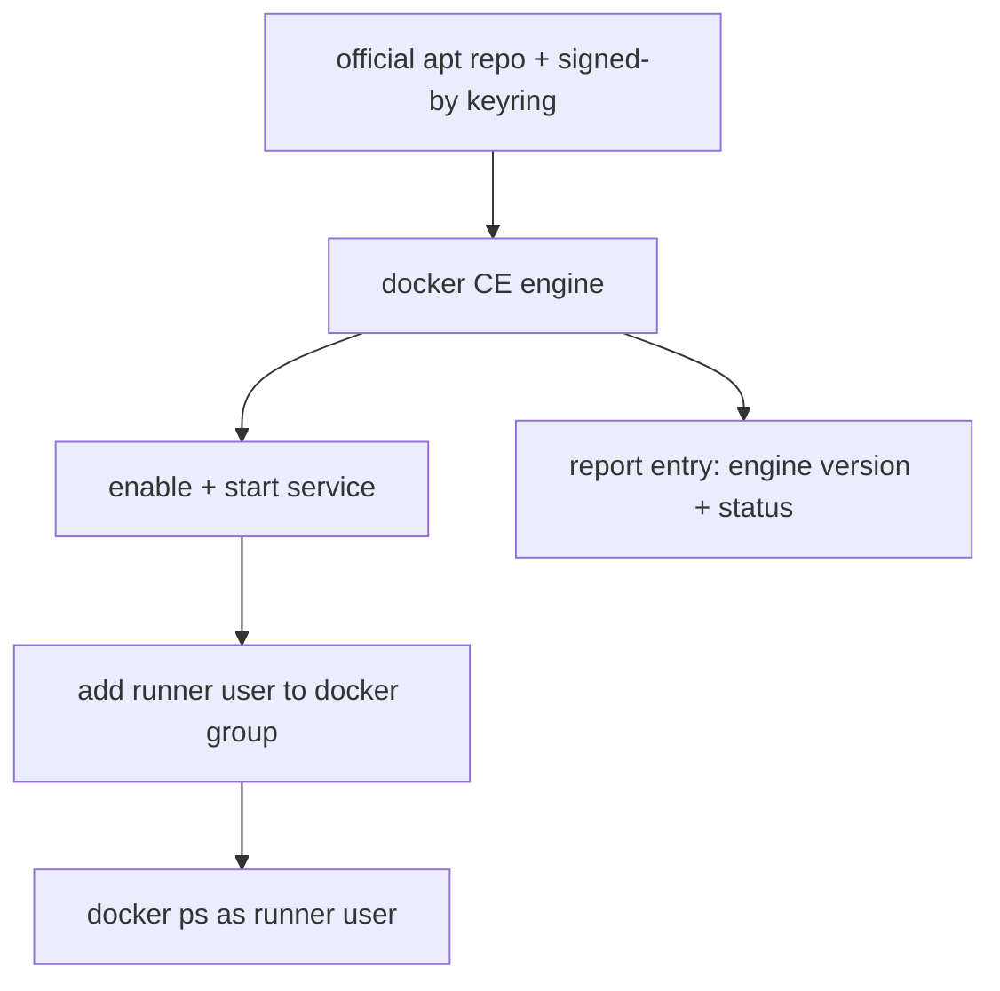

# Role: docker

Installs the **Docker CE** engine from Docker's official apt repo, enables
the service, and adds the runner service user to the `docker` group. It is
the **section-3** ("base-image / daemon") toolchain mechanism - the
counterpart to the section-1
[host-push pattern](../toolchain_host_push/README.md) (heavy pushed
tarballs) and the section-2 [apt pattern](../toolchain_apt/README.md)
(small VM-pulled packages). A daemon is a rarely-versioned service, so it
is installed at a coarser grain: its own apt repo, a system service to
enable, and group membership so a non-root runner can reach the socket. See
[the plan](../../docs/dev/implementation/19-common-ansible-extraction-and-toolchain-provisioning/plan.md#step-81---docker-role-repo-engine-service-group).

## Index

- [Var contract](#var-contract)
- [What it does](#what-it-does)
- [Why an Ansible role, not base-image baking](#why-an-ansible-role-not-base-image-baking)
- [Idempotence](#idempotence)
- [Security: the docker group is root-equivalent](#security-the-docker-group-is-root-equivalent)
- [Consuming this role](#consuming-this-role)
- [Tests](#tests)

## Var contract

Full field documentation lives in
[`defaults/main.yml`](defaults/main.yml). In brief:

- `docker_group_members` (default `[]`) - users to add to the `docker`
  group so they reach the daemon socket without sudo. Empty installs the
  engine but grants no membership; a consumer names the runner service
  user here. Membership is additive (never strips other groups).
- `docker_packages` (default: the five official Docker CE packages -
  `docker-ce`, `docker-ce-cli`, `containerd.io`, `docker-buildx-plugin`,
  `docker-compose-plugin`) - the engine package set. Unpinned: a daemon is
  rarely-versioned and Docker's repo carries only a rolling `stable`
  channel, not the per-version archive an apt pin would need.
- `docker_service_name` / `docker_service_enabled` / `docker_service_state`
  (default `docker` / `true` / `started`) - the daemon service to enable
  and start.
- `docker_group` (default `docker`) - the socket-owning group.
- `docker_apt_gpg_key_url` / `docker_apt_keyring_path` /
  `docker_apt_repo_base_url` / `docker_apt_repo_component` - the official
  repo coordinates; override all four to point at an internal mirror.
- `docker_apt_cache_valid_time` (default `3600`) - seconds the role trusts
  a previously-refreshed apt cache before updating again (the idempotence
  throttle, mirroring `toolchain_apt`).

## What it does

1. **Repo** - installs `ca-certificates`/`curl`, fetches Docker's GPG key
   to a dedicated keyring (`/etc/apt/keyrings/docker.asc`), and adds
   Docker's apt source (`deb822` format, `signed-by` that keyring so the
   key authorises only Docker's source).
2. **Engine** - refreshes the apt cache (throttled) and installs the
   `docker_packages` set in one transaction.
3. **Service** - enables and starts the `docker` systemd service.
4. **Group** - ensures the `docker` group exists and adds each
   `docker_group_members` user to it with `append` (so the socket is
   reachable without sudo).
5. **Report** - reads the installed engine version from the package
   database and appends one entry to the per-host
   [toolchain report](../toolchain_report/README.md). The version comes
   from `dpkg-query` rather than `docker --version` so the report still
   names a version when the daemon is installed but not yet answering,
   and the status comes from the engine install task's `changed` flag.
   No paths are reported - dpkg owns the engine's filesystem footprint,
   and the report renders such an entry as dpkg-managed rather than as an
   empty block. This role contributes nothing to the artifact report:
   apt manages its own download cache, and this stack transfers nothing.



## Why an Ansible role, not base-image baking

Docker is section-3, and section-3 tools *could* be baked into a golden
base image instead of installed per-VM. This estate installs it via an
Ansible role because there is no Packer/golden-image pipeline today, so
"base image" would mean cloud-init `runcmd`, which forces relaxing the
seed's deliberate offline stance and pushes a daemon install into
hard-to-debug first boot. The runner VMs already receive an Ansible pass,
so a docker role is co-located, idempotent, and re-runnable. Base-image
baking is revisited only if a measured boot-time or fleet-scale problem
appears (recorded in the problem doc's "Out of scope").

The role installs the daemon with `ansible.builtin` modules only
(`get_url`, `deb822_repository`, `apt`, `systemd_service`, `group`,
`user`); it pulls in no `community.docker` collection, because that
collection manages containers *on* a running daemon - a consumer concern,
not installing the daemon.

## Idempotence

Every step re-runs clean:

- The GPG key `get_url` skips the download once the keyring exists.
- `deb822_repository` manages the whole `.sources` file, so an unchanged
  repo reports no change.
- The apt cache refresh is throttled by `docker_apt_cache_valid_time`, so a
  re-run inside the window is `changed: 0` (the spurious-change guard, as
  in `toolchain_apt`).
- `apt state: present`, `systemd_service enabled+started`, `group present`,
  and `user append` are all no-ops when already satisfied.

The molecule scenario asserts this via `molecule idempotence`.

## Security: the docker group is root-equivalent

A member of the `docker` group can bind-mount the host root filesystem into
a container and act as root on the host. Keep `docker_group_members` to the
CI runner service account only - never add interactive logins. This is the
whole reason the group is an explicit, opt-in var rather than something the
role grants automatically.

## Consuming this role

Include it and name the runner service user:

```yaml
- name: Install the Docker daemon for the CI runner
  ansible.builtin.include_role:
    name: docker
  vars:
    docker_group_members:
      - runner
```

With an empty `docker_group_members` (the default) the role still installs
and starts the engine - useful for a host where only root drives Docker.

## Tests

[`Tests/molecule/docker/`](../../Tests/molecule/docker/) has one scenario
covering the plan's cases - engine installed, service active, a target user
in the `docker` group, `docker ps` reachable, and an idempotent re-run.

The report accumulator is a fact, so it cannot be asserted from
`verify.yml` (a separate `ansible-playbook` run with no fact cache) -
`converge.yml` asserts it instead: exactly one entry (this is a presence
gate, not a set to reconcile), a non-empty version read from the package
database, and no claimed paths.

### The docker-in-docker molecule caveat

Testing a daemon-install role in a container needs two things a normal
molecule container does not have, so the scenario's `molecule.yml` sets
them and its `Dockerfile` bakes them in:

- **systemd as init** - the role enables/starts the service via
  `systemd_service`, so the container must run `systemd` as PID 1
  (`command: /usr/sbin/init`), not the `sleep infinity` the section-1/2
  base images use.
- **privileged (docker-in-docker)** - the Docker daemon needs kernel
  capabilities (cgroups, netfilter, overlay mounts) it cannot get in an
  unprivileged container, so the platform runs `privileged: true` with the
  cgroup mount. This is genuine docker-in-docker: the inner daemon really
  starts, so `verify` can run `docker ps` rather than merely asserting the
  package is present.

On Docker Desktop (Windows/WSL2) this relies on the host exposing cgroup v2
to the privileged container; the scenario is the documented way to
reproduce a real daemon start locally.
