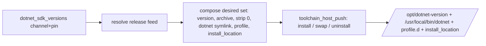

# Role: dotnet_sdk

Installs, swaps, and uninstalls a .NET SDK on the target, resolving an
operator channel + version pin against Microsoft's release-metadata feed.
It is the second real consumer of the section-1
[host-push toolchain pattern](../toolchain_host_push/README.md): it adds
**only** the release-feed resolve/version logic and delegates every
install, version-swap, and uninstall mechanic to `toolchain_host_push`.
Ports the PowerShell reconciler's `DotnetSdkProvider`
(`Infrastructure-Vm-Provisioner` `up/dotnet`); see
[the plan](../../docs/dev/implementation/19-common-ansible-extraction-and-toolchain-provisioning/plan.md#step-53---dotnet_sdk-role).

## Index

- [Var contract](#var-contract)
- [What it adds on the pattern](#what-it-adds-on-the-pattern)
- [Version-pin resolution](#version-pin-resolution)
- [Where the feed query runs](#where-the-feed-query-runs)
- [Consuming this role](#consuming-this-role)
- [Tests](#tests)
- [Parity with the PowerShell reconciler](#parity-with-the-powershell-reconciler)

## Var contract

Full field documentation lives in
[`defaults/main.yml`](defaults/main.yml). In brief:

- `dotnet_sdk_versions` (default `[]`) - the desired SDK entries. Each is a
  `{channel, version}` mapping: `channel` is `<major>.<minor>` (e.g.
  `10.0`) and `version` is a granularity string (`10`, `10.0`, or
  `10.0.100`). Empty uninstalls every SDK the pattern installed. **v1 caps
  the list at one** (a longer list is a hard error).
- `dotnet_sdk_releases_base_url` (default
  `https://builds.dotnet.microsoft.com/dotnet/release-metadata`) - the feed
  base, overridable for a fixture or a caching mirror. The resolver appends
  `/<channel>/releases.json`.
- `dotnet_sdk_rid` (default `linux-x64`) - the runtime identifier selecting
  which per-file entry is the tarball to install.
- `dotnet_sdk_install_base` (default `/opt`) - forwarded to
  `toolchain_host_push` and used for `DOTNET_ROOT` and
  `/etc/dotnet/install_location`, so the install dir and the wiring stay in
  lockstep.
- `dotnet_sdk_tools_root` (default `/usr/local/share/dotnet/tools`) - the
  global-tools dir wired onto `PATH` in the profile; owned by the nested
  `dotnet_tools` role but its PATH entry lives here so one `dotnet.sh` is
  the single source of truth for the dotnet PATH.

## What it adds on the pattern

The mechanics - download the tarball from the substrate host file server,
extract to `/opt/dotnet-<version>`, symlink into `/usr/local/bin`, write
`/etc/profile.d/dotnet.sh`, write and later remove
`/etc/dotnet/install_location`, record a manifest, and remove versions no
longer desired - all live in `toolchain_host_push`. This role only:

1. Asserts the single-SDK cap.
2. Resolves each `{channel, version}` to a concrete `{version, archive}`
   via the release feed
   ([`tasks/_resolve-dotnet-release.yml`](tasks/_resolve-dotnet-release.yml)).
3. Composes the pattern's desired set - each entry carries
   `strip_components: 0` (the SDK tarball is flat, no wrapper dir), a single
   `dotnet` symlink (every tool dispatches through the driver), a
   `DOTNET_ROOT` + tools-PATH + telemetry-opt-out profile, and an
   `owned_files` entry for `/etc/dotnet/install_location` - then delegates
   via `include_role` ([`tasks/main.yml`](tasks/main.yml)).



## Version-pin resolution

A port of `Resolve-DotnetSdkRelease`. The `channel` selects the
`releases.json` feed; the `version` granularity picks the SDK within it:

| Version pin | Resolves to                                             |
| ----------- | ------------------------------------------------------- |
| `10`        | the channel's `latest-sdk` (newest released SDK)        |
| `10.0`      | the channel's `latest-sdk` (newest released SDK)        |
| `10.0.100`  | the exact `10.0.100` SDK on the channel                 |

The resolver flattens `releases[].sdks[]` (the comprehensive plural list,
so side-by-side SDKs in one release entry are found), selects the entry
whose `version` equals the target, then picks its `linux-x64` `.tar.gz`
file. The resolved version keys the install dir, the manifest, and the
pattern's desired-vs-installed diff.

The resolver also captures the release `checksum` (sha512) and
`download_url`. This role does **not** verify the checksum: it installs
from the trusted substrate host file server, and .NET integrity is the
concern of the host-side staging step that downloads and stages the
tarball (the resolve/acquire split the PowerShell reconciler drew the same
way - `Invoke-DotnetSdkAcquisition` verified the hash, `Install-Version`
only extracted).

## Where the feed query runs

On the managed host (no `delegate_to`). The metadata query is small and
uses the host's normal egress; only the large tarball travels over the
substrate file server (the measured NAT-bypass). Running the query on the
target is also what lets the molecule scenarios mock the feed with an
in-container fixture bound to `127.0.0.1`. A fleet whose targets cannot
reach `builds.dotnet.microsoft.com` points `dotnet_sdk_releases_base_url`
at a reachable mirror.

## Consuming this role

```yaml
- name: Install a pinned .NET SDK
  ansible.builtin.include_role:
    name: dotnet_sdk
  vars:
    dotnet_sdk_versions:
      - channel: "10.0"
        version: "10"
```

`host_file_server_base_url` must be supplied by the bridge (the pattern
pulls the tarball from it), and the resolved tarball must be staged on that
file server under the name the feed reports (the file `name`).

## Tests

[`Tests/molecule/dotnet_sdk/`](../../Tests/molecule/dotnet_sdk/) covers the
plan's three cases, each driven by an in-container fixture
([`tasks/_fixture-dotnet.yml`](../../Tests/molecule/dotnet_sdk/tasks/_fixture-dotnet.yml))
that serves BOTH a canned `releases.json` feed and the fake SDK tarballs
from one `127.0.0.1` http server, so the resolve and the install run end to
end without touching the real feed:

- **default** - resolve pin `10` (major-only, via `latest-sdk`), install,
  then `molecule idempotence`. Verifies the install dir, the single
  `dotnet` symlink, the profile `DOTNET_ROOT` + telemetry opt-out, the
  `/etc/dotnet/install_location` content, the manifest (including
  `owned_files`), and that the symlinked `dotnet` runs.
- **reconcile** - prepare installs an exact `10.0.100`; converge desires
  `10.0.101` (version swap). Verifies the old version is fully gone
  (including its `install_location`) and the new one is active with its
  symlink and `install_location` retargeted.
- **remove** - prepare installs `10.0.100`; converge desires `[]`. Verifies
  every artifact - including `/etc/dotnet/install_location` - is removed.

## Parity with the PowerShell reconciler

The channel + version resolution, the `latest-sdk` deferral for
major/major.minor pins, the single-SDK cap, the flat-tarball extract
(`strip_components: 0`), the single `dotnet` driver symlink, the
`DOTNET_ROOT` + tools-PATH + telemetry-opt-out `dotnet.sh`, and the
`/etc/dotnet/install_location` runtime hint all mirror `DotnetSdkProvider`.
The one deliberate divergence is the checksum placement (staging-time, not
install-time - see [above](#version-pin-resolution)), which follows the
reconciler's own acquire/install split. The nested global-tools behaviour
(`dotnet tool` install/teardown ordering) is a separate role
(`dotnet_tools`, plan step 5.4), not this one.
