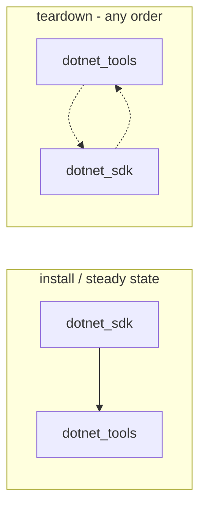

# Role: dotnet_tools

Installs, swaps, and uninstalls .NET **global tools** on the target via the
`dotnet tool` driver, recording each install as a manifest so removal is
glob-free. It is the nested global-tools half of the .NET toolchain; the SDK
half is the sibling [`dotnet_sdk`](../dotnet_sdk/README.md) role. Ports the
PowerShell reconciler's `DotnetToolsProvider`
(`Infrastructure-Vm-Provisioner` `up/dotnet`); see
[the plan](../../docs/dev/implementation/19-common-ansible-extraction-and-toolchain-provisioning/plan.md#step-54---dotnet_tools-role-nested-under-sdk).

## Index

- [Var contract](#var-contract)
- [Relationship to the SDK role](#relationship-to-the-sdk-role)
- [Parent/child ordering](#parentchild-ordering)
- [How it installs a tool](#how-it-installs-a-tool)
- [How it uninstalls a tool](#how-it-uninstalls-a-tool)
- [Consuming this role](#consuming-this-role)
- [Tests](#tests)
- [Parity with the PowerShell reconciler](#parity-with-the-powershell-reconciler)

## Var contract

Full field documentation lives in
[`defaults/main.yml`](defaults/main.yml). In brief:

- `dotnet_tools_tools` (default `[]`) - the desired global-tool entries.
  Each is an `{id, version}` mapping: `id` is the NuGet package id (e.g.
  `dotnet-reportgenerator-globaltool`), `version` the exact NuGet version.
  Empty uninstalls every tool this role has a manifest for. The diff keys on
  the composite `<id>@<version>` (two tools may share a NuGet version).
- `dotnet_tools_root` (default `/usr/local/share/dotnet/tools`) - the
  `--tool-path`. **Must equal** the SDK role's `dotnet_sdk_tools_root`,
  which wires this dir onto `PATH` in the single `/etc/profile.d/dotnet.sh`.
- `dotnet_tools_dotnet_bin` (default `/usr/local/bin/dotnet`) - the driver
  the tool operations run, the symlink the SDK role creates.
- `dotnet_tools_manifest_dir` (default
  `/var/lib/common-ansible/toolchains/manifests`) - the shared manifest
  store; tool manifests are `dotnettool-<id>-<version>.json` (no glob
  collision with the SDK's `dotnet-*.json`).
- `dotnet_tools_staging_base` (default
  `/var/lib/common-ansible/toolchains/dotnet-tool-staging`) - per-tool
  `.nupkg` + `NuGet.Config` staging root, wiped after each install.
- `host_file_server_base_url` (bridge-supplied, required when installing) -
  the substrate file server the `.nupkg` is pulled from, at
  `<base>/dotnet-tool-<id>-<version>.nupkg`.

## Relationship to the SDK role

Unlike `jdk` / `dotnet_sdk`, this role does **not** build on
[`toolchain_host_push`](../toolchain_host_push/README.md): a global tool is
a NuGet package installed by the `dotnet tool` driver, not a tarball
extracted to `/opt`. What the two share is the manifest-driven
desired-vs-installed reconcile (read manifests -> stale/missing diff ->
uninstall-stale-then-install-missing), which this role **mirrors** rather
than delegates, because the install/uninstall mechanics differ entirely.

The two roles are otherwise decoupled: the SDK owns
`/etc/profile.d/dotnet.sh` (including the tools dir on `PATH`) and the
`dotnet` driver; this role owns only the tools it installs and their
`/usr/local/bin` shim symlinks. There is deliberately **no** meta dependency
between them - the consumer play composes the pair (see below).

## Parent/child ordering

**Install** needs the `dotnet` driver on `PATH`, which `dotnet_sdk` provides
via `/usr/local/bin/dotnet`. So a consumer play must run `dotnet_sdk` (or
ensure the SDK is present) **before** `dotnet_tools`, so the driver exists
when a tool installs.

**Teardown is order-independent.** The uninstall path is self-sufficient from
the manifest ([`tasks/_uninstall-tool.yml`](tasks/_uninstall-tool.yml)):
after a best-effort `dotnet tool uninstall` (the preferred clean path when the
driver is present), it removes the recorded command shims and the tool's
`.store` slot directly. So removing `dotnet_sdk` **before** `dotnet_tools` -
which a single install-ordered reconcile playbook does when driving every
toolchain to absent - no longer leaks the tool's `.store` slot the way it
would if uninstall depended on the now-absent driver.

Making uninstall driver-independent achieves the same no-leak outcome the
PowerShell reconciler's children-walker guaranteed with a tools-before-SDK
order, **without** imposing a teardown role order on the consumer. (Install
order still matters, and the install/steady-state order below is unchanged.)



## How it installs a tool

For each desired tool with no manifest
([`tasks/_install-tool.yml`](tasks/_install-tool.yml)):

1. Pull the `.nupkg` from `host_file_server_base_url` into a per-tool
   staging dir, under NuGet's flat-layout name `<id-lower>.<version>.nupkg`
   (the SDK local-source enumerator matches on that pattern).
2. Write a `NuGet.Config` there that `<clear />`s ambient sources and
   declares the staging dir as the sole source, so `--configfile` keeps the
   resolver offline.
3. `dotnet tool install <id> --tool-path <root> --configfile <cfg>
   --version <version>`.
4. Discover the command shim(s) the driver added by diffing the tool-path
   file listing before vs after the install (layout-independent, per-tool
   correct even with other tools present), and symlink each into
   `/usr/local/bin`.
5. Write the manifest **last** (crash-recovery anchor), recording the id,
   version, composite key, store dir, shim symlinks, and command names.
6. Wipe the staging dir (best-effort).

After the diff, two recording steps append to the per-host reports and
change no state on the VM:
[`tasks/_record-report.yml`](tasks/_record-report.yml) records what was
installed / left alone / removed for the
[toolchain report](../toolchain_report/README.md), and
[`tasks/_record-artifacts.yml`](tasks/_record-artifacts.yml) probes the
`.store` slot and records the package's provenance for the
[artifact report](../artifact_report/README.md). Tools are tagged
`host-push` there: the `.nupkg` is staged on the controller and pulled
over the substrate file server exactly like a tarball toolchain.

## How it uninstalls a tool

For each installed tool no longer desired
([`tasks/_uninstall-tool.yml`](tasks/_uninstall-tool.yml)), inverted from
install and driven by the manifest:

1. Remove the recorded `/usr/local/bin` shim symlinks (exactly the recorded
   paths - never a glob).
2. `dotnet tool uninstall <id> --tool-path <root>` - the driver's own clean
   removal, best-effort when the driver is present. Non-zero is logged, not
   fatal (an absent driver or already-freed slot must not block removal).
3. Guaranteed manifest-driven removal that backstops the driver so the store
   is freed even when the driver is gone: the recorded command shim binaries
   under `<root>`, then the tool's `.store/<id>` slot. A direct `rm` of that
   slot is safe because a `--tool-path` holds exactly one version per id
   (the driver rejects a second), so `.store/<id>` maps 1:1 to this install -
   not a cross-version glob. (This differs from the `--global` manifest store,
   which the driver alone owns.)
4. Remove the manifest **last** (recovery anchor).

## Consuming this role

```yaml
# SDK first so the driver exists, then the tools.
- name: Install the .NET SDK and its global tools
  hosts: builders
  tasks:
    - name: .NET SDK
      ansible.builtin.include_role:
        name: dotnet_sdk
      vars:
        dotnet_sdk_versions:
          - channel: "10.0"
            version: "10"

    - name: .NET global tools
      ansible.builtin.include_role:
        name: dotnet_tools
      vars:
        dotnet_tools_tools:
          - id: dotnet-reportgenerator-globaltool
            version: "5.4.4"
```

`host_file_server_base_url` must be supplied by the bridge, and each tool's
`.nupkg` must be staged on that file server as
`dotnet-tool-<id>-<version>.nupkg` (the acquisition/staging step, plan 5.5).
Teardown role order does not matter - the uninstall frees the `.store` slot
even if `dotnet_sdk` was removed first; see
[Parent/child ordering](#parentchild-ordering).

## Tests

[`Tests/molecule/dotnet_tools/`](../../Tests/molecule/dotnet_tools/) drives a
tool-capable `dotnet` stub (staged as a fake SDK and installed via the real
`dotnet_sdk` role, so the driver, profile, and tools `PATH` are wired
exactly as production) served together with fake `.nupkg` packages from one
`127.0.0.1` http fixture:

- **default** - with the SDK present, install a tool, then
  `molecule idempotence`. Verifies the `.store` slot, the `/usr/local/bin`
  shim symlink, the manifest (id, version, key, symlinks, commands), and
  that the symlinked command runs.
- **remove** - install the SDK and a tool, then converge `dotnet_sdk` (empty
  desired set) **before** `dotnet_tools` (empty desired set) - i.e. the SDK
  driver is torn down *first*, the order an install-ordered reconcile playbook
  uses and the one that used to leak. Verifies the tool is fully removed (shim
  symlink, tool-path shim binary, `.store/<id>` slot, manifest) **and** the
  SDK is removed - proving the manifest-driven uninstall frees the store
  without the driver. This is the regression guard for the driver-independent
  teardown.

Both report accumulators are facts, so they cannot be asserted from
`verify.yml` (a separate `ansible-playbook` run with no fact cache) - the
**default** scenario's `converge.yml` asserts them instead: the toolchain
entry's `.store` install dir and shim symlinks, and the artifact entry's
source URL plus its empty-path-with-a-note (the `.nupkg` is staged then
wiped, and an empty path with no note would read as "lost" rather than
"by design").

## Parity with the PowerShell reconciler

The composite `<id>@<version>` diff identity, the offline `--configfile`
install from a pinned local source, the per-command `/usr/local/bin` shim
symlinks recorded for glob-free removal, and the manifest-last ordering all
mirror `DotnetToolsProvider`. Where this role **diverges** for robustness: the
PowerShell children-walker enforced a tools-before-SDK teardown so
`dotnet tool uninstall` always had a driver; here the uninstall instead frees
the `.store/<id>` slot directly from the manifest (driver-preferred, direct-rm
backstop), so a single install-ordered reconcile play tears every toolchain
down without a leak and the consumer owes no teardown role order. The `.nupkg`
acquisition + checksum verification is the consumer/staging step's concern
(plan 5.5), not this role's - the same acquire/install split the reconciler
drew.
