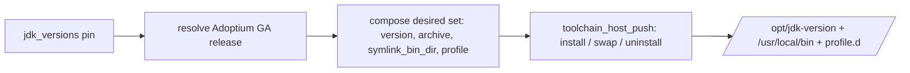

# Role: jdk

Installs, swaps, and uninstalls an Eclipse Temurin JDK on the target,
resolving an operator version pin against the Adoptium release API. It is
the first real consumer of the section-1
[host-push toolchain pattern](../toolchain_host_push/README.md): it adds
**only** the Adoptium resolve/version logic and delegates every install,
version-swap, and uninstall mechanic to `toolchain_host_push`. Ports the
PowerShell reconciler's `JdkProvider`
(`Infrastructure-Vm-Provisioner` `up/jdk`); see
[the plan](../../docs/dev/implementation/19-common-ansible-extraction-and-toolchain-provisioning/plan.md#step-52---jdk-role).

## Index

- [Var contract](#var-contract)
- [What it adds on the pattern](#what-it-adds-on-the-pattern)
- [Version-pin resolution](#version-pin-resolution)
- [Where the Adoptium query runs](#where-the-adoptium-query-runs)
- [Consuming this role](#consuming-this-role)
- [Tests](#tests)
- [Parity with the PowerShell reconciler](#parity-with-the-powershell-reconciler)

## Var contract

Full field documentation lives in
[`defaults/main.yml`](defaults/main.yml). In brief:

- `jdk_versions` (default `[]`) - the desired JDK version pins. Each is a
  granularity string: `21`, `21.0`, `21.0.5`, or `21.0.5+11`. Empty
  uninstalls every JDK the pattern installed. **v1 caps the list at one**
  (a longer list is a hard error).
- `jdk_vendor` (default `temurin`) - the only supported vendor in v1
  (Adoptium serves Temurin only); asserted.
- `jdk_adoptium_api_base_url` (default `https://api.adoptium.net/v3`) -
  the API base, overridable for a fixture or a caching mirror.
- `jdk_architecture` / `jdk_os` / `jdk_image_type` (default
  `x64` / `linux` / `jdk`) - the Adoptium binary selectors.
- `jdk_install_base` (default `/opt`) - forwarded to
  `toolchain_host_push` and used for `JAVA_HOME`, so the install dir and
  the profile script stay in lockstep.

## What it adds on the pattern

The mechanics - download the tarball from the substrate host file server,
extract to `/opt/jdk-<version>`, symlink into `/usr/local/bin`, write
`/etc/profile.d/jdk.sh`, record a manifest, and remove versions no longer
desired - all live in `toolchain_host_push`. This role only:

1. Asserts the vendor and the single-JDK cap.
2. Resolves each pin to a concrete `{version, archive}` via the Adoptium
   API ([`tasks/_resolve-adoptium-release.yml`](tasks/_resolve-adoptium-release.yml)).
3. Composes the pattern's desired set - each entry carries
   `symlink_bin_dir: bin` (symlink every launcher under the JDK's `bin/`,
   a set only known post-extraction) and a `JAVA_HOME` + `PATH` profile -
   then delegates via `include_role`
   ([`tasks/main.yml`](tasks/main.yml)).



## Version-pin resolution

A port of `Resolve-AdoptiumRelease`. The pin's granularity drives the
query and the local filter:

| Pin          | API `page_size` | Local filter                        |
| ------------ | --------------- | ----------------------------------- |
| `21`         | 1               | none - take the newest GA           |
| `21.0`       | 50              | `minor == 0`                        |
| `21.0.5`     | 50              | `minor == 0`, `security == 5`       |
| `21.0.5+11`  | 50              | `minor == 0`, `security == 5`, `build == 11` |

The API is queried `sort_order=DESC`, so the first surviving candidate is
the newest match. The resolved version is Adoptium's `openjdk_version`
(e.g. `21.0.5+11`), which keys the install dir, the manifest, and the
pattern's desired-vs-installed diff.

The resolver also captures the release `checksum` and `download_url`.
This role does **not** verify the checksum: it installs from the trusted
substrate host file server, and Adoptium integrity is the concern of the
host-side staging step that downloads and stages the tarball (the
resolve/acquire split the PowerShell reconciler drew the same way -
`Invoke-JdkAcquisition` verified the hash, `Install-JdkVersion` only
extracted).

## Where the Adoptium query runs

On the managed host (no `delegate_to`). The metadata query is small and
uses the host's normal egress; only the large tarball travels over the
substrate file server (the measured NAT-bypass). Running the query on the
target is also what lets the molecule scenarios mock the API with an
in-container fixture bound to `127.0.0.1`. A fleet whose targets cannot
reach `api.adoptium.net` points `jdk_adoptium_api_base_url` at a reachable
mirror.

## Consuming this role

```yaml
- name: Install a pinned JDK
  ansible.builtin.include_role:
    name: jdk
  vars:
    jdk_versions:
      - "21"
```

`host_file_server_base_url` must be supplied by the bridge (the pattern
pulls the tarball from it), and the resolved tarball must be staged on
that file server under the name Adoptium reports (`package.name`).

## Tests

[`Tests/molecule/jdk/`](../../Tests/molecule/jdk/) covers the plan's three
cases, each driven by an in-container fixture
([`tasks/_fixture-adoptium.yml`](../../Tests/molecule/jdk/tasks/_fixture-adoptium.yml))
that serves BOTH a canned Adoptium `feature_releases` response and the
fake JDK tarballs from one `127.0.0.1` http server, so the resolve and the
install run end to end without touching the real API:

- **default** - resolve pin `21` (major-only), install, then `molecule
  idempotence`. Verifies the install dir, that `symlink_bin_dir` linked
  every `bin/` launcher (`java` and `javac`), the profile `JAVA_HOME`, the
  manifest, and that the symlinked `java` runs.
- **reconcile** - prepare installs a `21.0.1` resolution; converge desires
  `21.0.2` (version swap). Verifies the old version is fully gone and the
  new one is active with its symlinks retargeted.
- **remove** - prepare installs `21.0.1`; converge desires `[]`. Verifies
  every artifact is removed.

## Parity with the PowerShell reconciler

The resolve granularities, the newest-match selection, the single-JDK
cap, the `/etc/profile.d/jdk.sh` `JAVA_HOME`+`PATH` wiring, and symlinking
every `bin/` launcher into `/usr/local/bin` all mirror `JdkProvider`. The
one deliberate divergence is the checksum placement (staging-time, not
install-time - see [above](#version-pin-resolution)), which follows the
reconciler's own acquire/install split.
