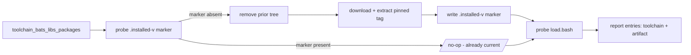

# Role: toolchain_bats_libs

Installs pinned **bats helper libraries** (bats-support, bats-assert, ...)
directly on the target VM, idempotently. It is the section-2
("VM-downloaded") **`get_url` sibling** of
[toolchain_apt](../toolchain_apt/README.md): where `toolchain_apt` installs
tools the distro archive can serve (shellcheck, the `bats` binary), this
role installs the bats libraries that are **not apt packages** - plain bash
sources published only as `bats-core` GitHub tag tarballs. `toolchain_apt`'s
README anticipates exactly this sibling, "added when a consumer first needs
one".

## Index

- [Why this role exists](#why-this-role-exists)
- [Var contract](#var-contract)
- [What it does](#what-it-does)
- [Idempotence](#idempotence)
- [Consuming this role](#consuming-this-role)
- [Consuming the baked libraries in CI](#consuming-the-baked-libraries-in-ci)
- [Tests](#tests)

## Why this role exists

`bats-core/bats-action` installs these libraries into `/usr/lib/bats-*` on
**every CI run**, and that install uses `sudo`. On a GitHub-hosted runner
the runner account has passwordless sudo, so it is invisible; on a
self-hosted runner whose CI user does not, the run fails with
`sudo: a password is required`.

Baking the libraries onto the VM once - as the privileged **deploy** user
this provisioning flow already runs as - lets the unprivileged CI user
consume them **read-only**, with no per-run sudo and no per-run download.
The CI action is then told to skip its own library install (see
[Consuming the baked libraries in CI](#consuming-the-baked-libraries-in-ci)).

## Var contract

Full field documentation lives in
[`defaults/main.yml`](defaults/main.yml). In brief:

- `toolchain_bats_libs_packages` (default `[]`) - the desired libraries.
  Empty is a no-op, so a play can always include the role and let config
  decide the set. Each entry:
  - `name` (required) - the `bats-core` library repo name (e.g.
    `bats-support`).
  - `version` (required) - the exact release tag **without** the leading
    `v` (e.g. `0.3.0`). A pin is mandatory: these libraries ship no distro
    package to fall back on, so an unpinned entry would make a re-provision
    non-reproducible.
- `toolchain_bats_libs_base_dir` (default `/usr/lib`) - the base the
  libraries install under, one `<base>/<name>/` each. Matches the layout
  `bats-core/bats-action` uses, so a `BATS_LIB_PATH` pointed here resolves
  the libraries identically whether baked or action-installed.
- `toolchain_bats_libs_github_owner` (default `bats-core`) - the GitHub
  owner the tarballs are fetched from; overridable only to redirect at a
  mirror in a restricted-egress environment.

## What it does

For each entry, reconciles `<base>/<name>/` against the pinned tag:

1. Asserts every entry names a library and pins a version (a config typo
   fails here, naming the offending entry, not later as an opaque download
   error).
2. Probes the `.installed-v<version>` marker in the library directory - a
   version-encoded stamp answering "already at this exact pin?".
3. For each library whose marker is absent (missing, or pinned to a
   different version): removes any prior tree, recreates the directory,
   downloads and extracts the tag tarball (`--strip-components=1` drops the
   GitHub `<owner>-<repo>-<sha>/` top dir so `load.bash` and `src/` land
   directly), then writes the marker last.
4. Probes each library's `load.bash` - the file `bats_load_library <name>`
   actually sources, so its absence is the precise failure behind an
   "unable to load" suite. Probed unconditionally: on a converged run
   every install task above is skipped, which is exactly when this is
   worth knowing.
5. Appends one entry per library to the per-host
   [toolchain report](../toolchain_report/README.md) and one to the
   [artifact report](../artifact_report/README.md). The marker probe from
   step 2 doubles as the status source - a marker that already existed
   means this run left the library alone. The artifact entry carries an
   empty path plus a note: the tag tarball is streamed straight into the
   library directory by `remote_src` unarchive, so it never lands as a
   file, and the note is what stops that reading as "lost" rather than
   "by design".



## Idempotence

The marker file name encodes the version, so a re-run at the same pin finds
the marker and skips every install task (`changed: 0`). A version bump
changes the marker path: the old marker no longer matches, the library is
wiped and reinstalled at the new tag, and the new marker is written. The
marker is written **last**, so an interrupted install leaves none and the
next run retries rather than trusting a half-populated directory. The
molecule scenario asserts the clean re-run via `molecule idempotence`.

## Consuming this role

Include it with the desired library set:

```yaml
- name: Install the pinned bats libraries
  ansible.builtin.include_role:
    name: toolchain_bats_libs
  vars:
    toolchain_bats_libs_packages:
      - name: bats-support
        version: "0.3.0"
      - name: bats-assert
        version: "2.1.0"
```

## Consuming the baked libraries in CI

Baking is only half the fix - the CI action must stop installing the
libraries itself. In `Common-Automation`'s `test-bats` action the
`bats-core/bats-action` step passes `support-install: false` (and the
`assert` / `detik` / `file` equivalents) and points `BATS_LIB_PATH` at
`toolchain_bats_libs_base_dir` so `bats_load_library <name>` resolves the
baked copies. The binary the action still installs into `$HOME` needs no
sudo; only the libraries did.

## Tests

[`Tests/molecule/toolchain_bats_libs/`](../../Tests/molecule/toolchain_bats_libs/)
covers the absent -> present -> loadable -> idempotent shape against a real
container:

- **prepare** installs the `bats` binary (so verify can actually load a
  library) and asserts the target library directory is absent - the
  baseline.
- **converge** installs `bats-support` and `bats-assert` via the role;
  `molecule idempotence` re-runs it and asserts `changed: 0`.
- **verify** asserts each `load.bash` and `.installed-v<version>` marker is
  on disk, and runs a trivial `.bats` file that `bats_load_library`s both
  libraries and uses an `assert` - proving the baked libraries are not just
  present but loadable by a real bats run.

Both report accumulators are facts, so they cannot be asserted from
`verify.yml` (a separate `ansible-playbook` run with no fact cache) -
`converge.yml` asserts them instead. Because this scenario converges
**two** libraries, it is also the only one that proves the accumulators
*append* rather than overwrite: a producer that assigned instead of
appending would leave a single entry here and still pass every
single-item scenario.
