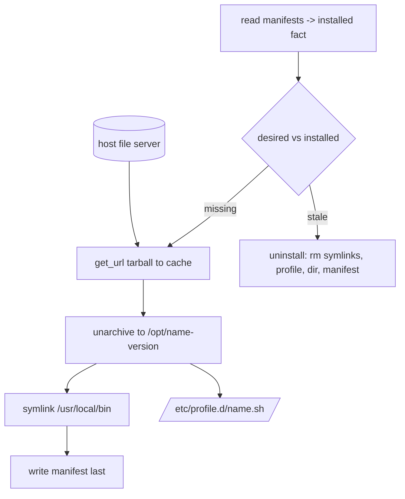

# Role: toolchain_host_push

The shared **section-1 host-push toolchain** mechanism. It pulls a
host-staged tarball via the substrate file server, extracts it to a
versioned install dir, wires `/usr/local/bin` symlinks and an
`/etc/profile.d` script, records each install as a manifest, and removes
versions no longer desired. The `jdk` / `dotnet_sdk` roles build on it,
resolving only their own version and tarball name and delegating the
mechanics here (see
[the plan](../../docs/dev/implementation/19-common-ansible-extraction-and-toolchain-provisioning/plan.md#step-51---author-the-host-push-toolchain-role-pattern)).

## Index

- [Var contract](#var-contract)
- [Reconcile flow](#reconcile-flow)
- [Manifest and record model](#manifest-and-record-model)
- [Idempotence guarantees](#idempotence-guarantees)
- [Consuming this role](#consuming-this-role)
- [Tests](#tests)
- [Rationale](#rationale)

## Var contract

Full field documentation lives in
[`defaults/main.yml`](defaults/main.yml). In brief:

- `toolchain_host_push_name` (required) - tool identity. Drives the
  install-dir prefix (`/opt/<name>-<version>`), the
  `/etc/profile.d/<name>.sh` script name, and the manifest file name. One
  tool per role invocation.
- `host_file_server_base_url` (required) - base URL of the substrate host
  file server; the bridge supplies it. Tarballs pull from
  `<base_url>/<archive>`. Shared bridge contract var, so no role-name
  prefix.
- `toolchain_host_push_versions` (default `[]`) - the desired set. Empty
  uninstalls every installed version of this tool. Each entry:
  `version` (required), `archive` (required), `strip_components` (default
  `1`), `symlinks` (list of `{name, source}`), `symlink_bin_dir` (subdir
  whose files are all symlinked into `/usr/local/bin`, enumerated at
  install time - for tools like the JDK whose launcher set is only known
  post-extraction), `profile` (verbatim `/etc/profile.d` content, omitted
  for none).
- `toolchain_host_push_install_base` (default `/opt`),
  `toolchain_host_push_cache_dir`
  (default `/var/cache/common-ansible/toolchains`),
  `toolchain_host_push_manifest_dir`
  (default `/var/lib/common-ansible/toolchains/manifests`) - roots,
  rarely overridden.

## Reconcile flow

A three-part diff of desired versus installed
([`tasks/main.yml`](tasks/main.yml)):

1. **Read** the on-disk manifests for this tool into the
   `toolchain_host_push_installed` fact.
2. **Uninstall** every installed version no longer desired
   ([`tasks/_uninstall-version.yml`](tasks/_uninstall-version.yml)),
   **before** installing, so a version swap frees the shared
   `/usr/local/bin/<name>` symlink and `/etc/profile.d/<name>.sh` script
   before the incoming version claims them.
3. **Install** every desired version not yet installed
   ([`tasks/_install-version.yml`](tasks/_install-version.yml)):
   download to the cache (stat-guarded), extract to
   `/opt/<name>-<version>/` (`--strip-components`), create the symlinks,
   write the profile script, then write the manifest **last**.

The install writes the manifest last and the uninstall removes it last,
so a crash mid-operation is self-healing: the next reconcile either sees
no manifest and re-installs cleanly, or sees the manifest and replays the
teardown.



## Manifest and record model

One JSON manifest per installed version under
`<manifest_dir>/<name>-<version>.json`:

```json
{
  "schema_version": 1,
  "name": "jdk",
  "version": "21.0.4",
  "install_dir": "/opt/jdk-21.0.4",
  "symlinks": [
    { "path": "/usr/local/bin/java", "target": "/opt/jdk-21.0.4/bin/java" }
  ],
  "profile_script": "jdk"
}
```

The manifest is the **source of truth** for what is installed and what
each version owns - deliberately **not** a `/opt/<name>-*` directory glob.
A glob races against anything an operator added by hand and can miss (or
wrongly claim) paths; the manifest records the exact install dir,
symlinks, and profile script the install created, so uninstall undoes
precisely that. This ports the PowerShell reconciler's manifest model
(`Infrastructure-Vm-Provisioner` `up/reconciler`), which chose the same
approach for the same reason.

`profile_script` is the tool name when a profile was written, else the
empty string (the uninstall skips the profile removal on empty).

`symlink_bin_dir` does not weaken this model: it enumerates a bin subdir
**at install time** and records each resulting link under `symlinks`, so
the manifest still names every owned path. The no-glob rule the record
model exists to enforce is about *uninstall*-time discovery (which would
race an operator's hand-edits); deriving the link set once, at install,
and pinning it in the manifest is exactly the guarantee that rule wants.

## Idempotence guarantees

- Re-running with the same `toolchain_host_push_versions` reports
  `changed: 0`: every desired version already has a manifest (so it is
  not in the `missing` set) and nothing is stale.
- A version swap (`{v1}` -> `{v2}`) uninstalls `v1` and installs `v2`
  once; a re-run is then a no-op.
- An empty desired set uninstalls every installed version; a re-run finds
  nothing installed and is a no-op.
- The cache download is stat-guarded, so a re-provision that still has
  the tarball cached skips the fetch.

## Consuming this role

A specialized toolchain role (`jdk`, `dotnet_sdk`) resolves its own
version and tarball name, then includes this role with the composed
`toolchain_host_push_versions` list - for example:

```yaml
- name: Reconcile the JDK via the host-push pattern
  ansible.builtin.include_role:
    name: toolchain_host_push
  vars:
    toolchain_host_push_name: jdk
    toolchain_host_push_versions: "{{ resolved_jdk_versions }}"
```

The specialized role owns the resolve/version logic; this role owns the
install/reconcile/remove mechanics.

## Tests

[`Tests/molecule/toolchain_host_push/`](../../Tests/molecule/toolchain_host_push/)
covers the four cases from the plan across three scenarios, each driven
by an in-container fixture file server
([`tasks/_fixture-fileserver.yml`](../../Tests/molecule/toolchain_host_push/tasks/_fixture-fileserver.yml)
builds fake tool tarballs and serves them on `127.0.0.1`):

- **default** - install one version, then `molecule idempotence`
  (install + idempotent re-run). Verifies the install dir, the symlink
  target, the profile script, the manifest content, and that the
  symlinked binary runs.
- **reconcile** - prepare installs `v1`, converge desires `v2` (version
  swap). Verifies `v1` is fully gone (dir, symlink, profile, manifest)
  and `v2` is active (symlink retargeted, profile updated).
- **remove** - prepare installs `v1`, converge desires `[]`
  (uninstall-removed-versions). Verifies every `v1` artifact is gone and
  the installed fact is empty.

## Rationale

The install/uninstall side-effect ordering (manifest written last,
removed last) is load-bearing for crash recovery and is inherited
directly from the PowerShell reconciler's `Install-*`/`Uninstall-*`
providers. The one deliberate divergence is the omission of a
process-drain step before directory removal: on Linux `rm` unlinks a path
even while a process holds an open fd, so an in-use binary does not block
removal - draining was a Windows file-lock concern the port does not
inherit.
